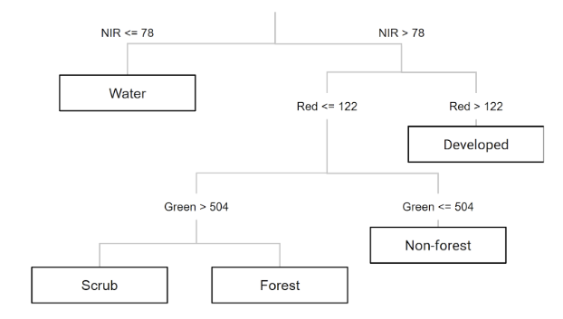
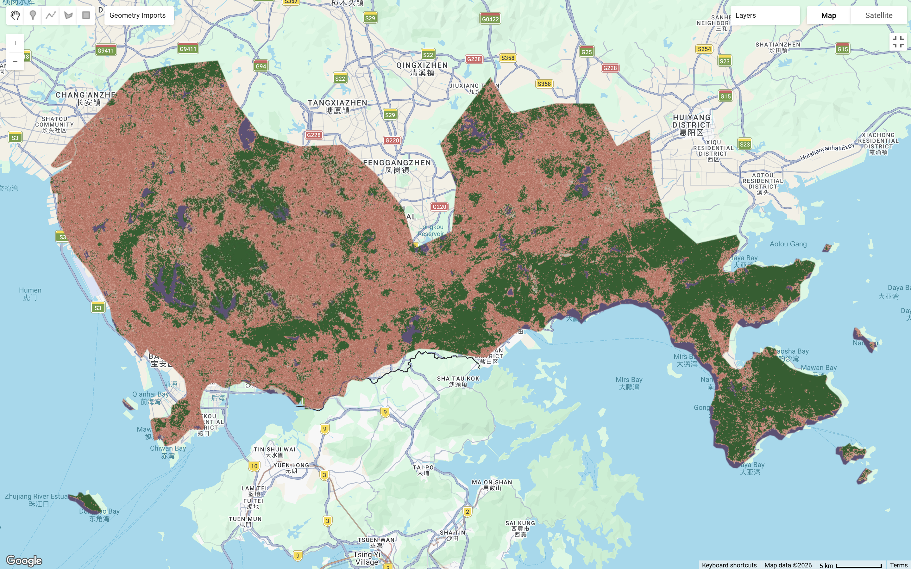
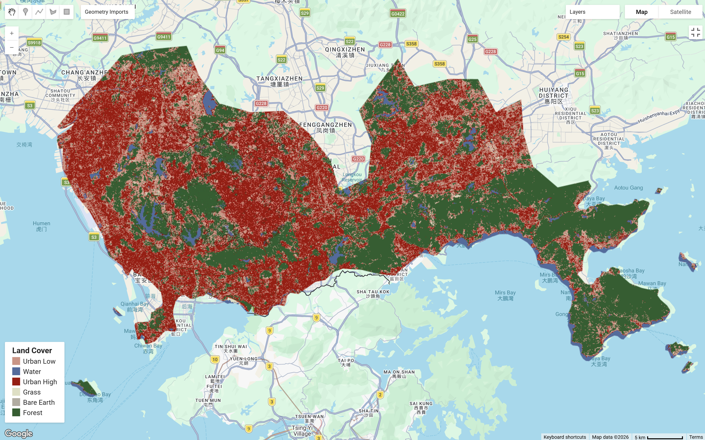
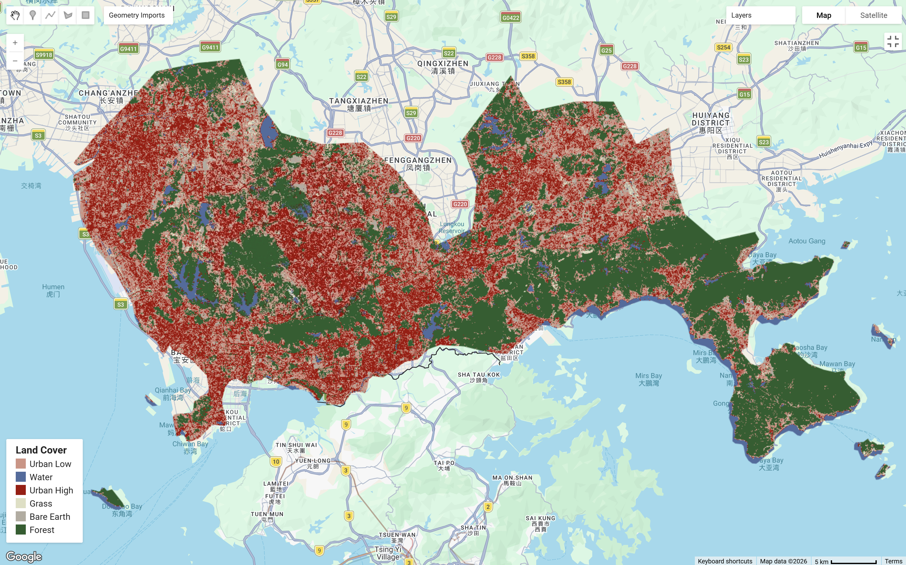
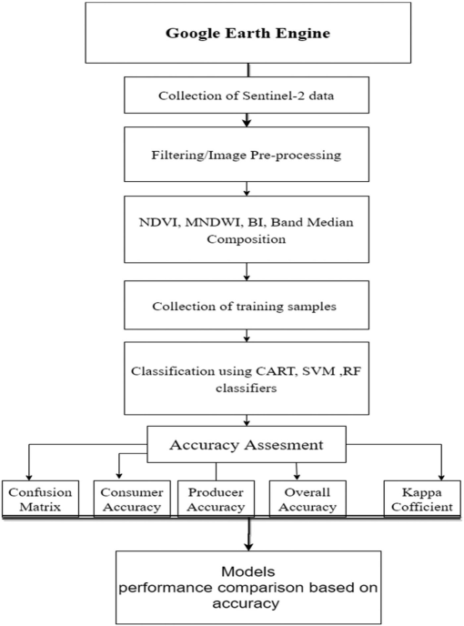
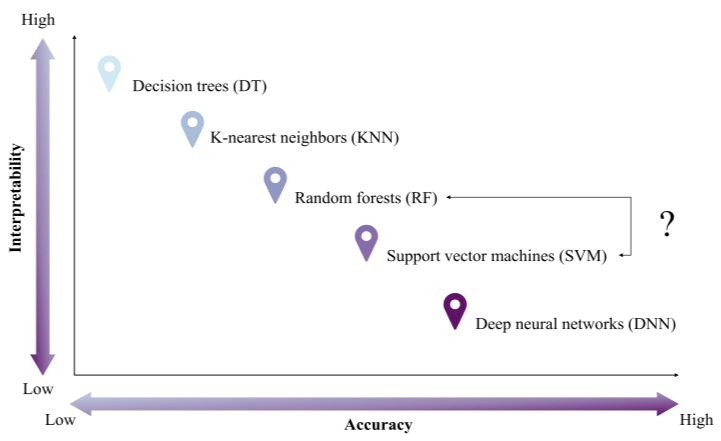

This section will build up the knowledge of GEE from last chapter and focus on using machine learning techniques for land use and land cover change (LULCC) with classification. The following study area in Shenzhen, China will be used for exploring supervised machine learning classification methods (CART and RF) processed through GEE.

## Summary

### Machine Learning

Machine learning plays an important role in LULCC, fostering automation, scalability, and improved accuracy. By learning complex patterns from satellite imagery, these algorithms can effectively identify different land types. They also handle large datasets efficiently, making it easier to track land use changes over time.

::: {style="border: 1px solid #ddd; border-left: 4px solid #5cb85c; padding: 10px 15px; color: #5cb85c; border-radius: 4px; margin-bottom: 15px;"}
Enable effective land management strategies, environmental conservation, sustainable planning and policy making [@pande2024; @zhao2024]
:::

#### Classification Techniques

There are two main types of classification,

-   **Supervised**: Learning patterns with knowledge and pre-defined spectral characteristics labeled for each class

-   **Unsupervised**: Learn patterns without pre-defined set of labeled training data

The below will discuss some commonly used classification methods:

| Machine Learning | Type | Description | Benefits | Limitations |
|---------------|---------------|---------------|---------------|---------------|
| Classification and Regression Tree (CART) | Supervised | One single decision tree that splits pixels into groups and predict a class | Can handle an enormous size of high resolution datasets without sacrificing processing performance | Prone to overfitting the model; Sensitive to changes in the training datasets which leads to comparably lower accuracy |
| Random Forest (RF) | Supervised | Generate numerous decision trees by randomly sampling variables and training datasets (often use 20 as a minimum) | High efficiency and accuracy; Easy to use; Able to learn booth simple and complex classification functions | May over-fit the training data which limits providing better accuracy |
| Support Vector Machine (SVM) | Supervised | Separate two classes of training data by finding a optimal boundary (separating hyperplane) | Computationally efficient; Works well with high-dimensionality with distinct margin of separation between classes | Difficult to use, interpret and fine-tune; Require lengthy training period for large datasets, can underestimate urban/ built-up classes |
| K-means clustering | Unsupervised | Group pixels near each other into clusters in the spectral space |  |  |

: Source: @zhao2024, @pande2024, @magidi2021

**Study Area: Shenzhen, China**

Sentinel-2 Surface Reflectance Harmonized data was loaded for minimal cloud cover and processed with cloud masking. To reduce cloud coverage and atmospheric noise, a median composite was taken from the time series, leaving raw spectral bands to be used for identifying LULCC. In this case, 6 land cover classes were defined as `urban_low`, `water`, `urban_high`, `grass`, `bare_earth`, and `forest` and merged into a feature collection for training.

The practical first applied Classification and Regression Tree (CART), which produced an initial classification result. Moving to Random Forest (RF), data were split into training and testing sets for 70% and 30% respectively. The pixel-based RF approach produced a more reliable classification as it used more pixels data within polygons which improved model performance.

::: {#CHUNKNAME layout-ncol="2"}

{#reference}
:::

Comparing both outputs, both have been able to capture a broadly correct pattern of land covers. RF resulted a less fragmented classification than CART, which is likely to be driven from the results derived from multiple decision trees, allowing lower sensitivity to noise and overfitting in comparison to the one tree CART.

::: {layout-ncol="1"}

:::

In the final output, I acquired a 11.7% random forest out of bag error estimate and a resubstitution accuracy of 99.7%. However, my validation overall accuracy of 88.1% indicates a 11.6% difference between training and testing which signals some mild overfitting, I assume it maybe caused by some spectral confusion of surface reflectance between urban_high and urban_low pixel values? In the study area Shenzhen, the heterogeneous urban landscape with diverse land covers within a small area is very likely to produce overlapping spectral signatures. This brings in one of the limitations of classification with spectral values, where `urban_high`, `urban_low` and `bare_earth` classes in reality may not be as distinguishable as others of `forest` and `water` even under pixel random forest. Therefore, I believe carefully defined classes and feature selection is as important as choosing the suitable method for classification, and further support with texture analysis could be considered for better accuracy (maybe consider using OBIA...).

::: {style="border: 1px solid #ddd; border-left: 4px solid #e0a800; padding: 10px 15px; color: #e0a800; border-radius: 4px; margin-bottom: 15px;"}
**Note that accuracy can be determined by...**

-   Selection of training data size and algorithm used for classification

-   It can be influenced by several factors, such as the choice of classifier, the quality of training data, terrain heterogeneity, dataset used, and the reference maps [@zhao2024].
:::

GEE code for this practical can be found [here](https://code.earthengine.google.com/0e536642eb70fc39e65513fb5eca24bc).

## Application

Machine learning models have been widely recommended for land use classification and change detections mapping\[@pande2022\]. LULCC analysis is a major application of remote sensing classification because it allows researchers to examine spatial patterns, identify and monitor temporal changes over time. These workflows can be analysed efficiently over GEE, making it exceptionally useful for environmental monitoring, urban expansion research and agricultural assessment applications[@pande2024].

Studies also show that classification accuracy depends not only on the classifier itself, but also on input better information and features. In addition to spectral bands, studies often incorporate bands combinations and derived features such as NDVI, MNDWI, and texture measures. @zhao2024 used a standard GEE-based workflow of LULCC, while @kupidura2019 indicated that combining spectral and textural information can improve classification accuracy, especially where classes have similar spectral signatures and when higher resolution imagery is used. This suggests that improving the feature set may be as important as changing the classifier.

::: {layout-ncol="1"}
{alt="RF Pixel"}
:::

Although more advanced machine-learning methods can sometimes achieve higher accuracy (e.g. deep learning algorithms), they often involve a trade-off in lower interpretability. Therefore, supervised classifiers such as CART, Random Forest, and SVM remain widely used in remote sensing analysis as they are easier to apply, able to work with smaller training datasets, and able to achieve decent classification accuracy.

{alt="Accuracy Trade-off in Machine Learning Classification Algorithms"}

## Reflection

Building on last week's introduction to GEE, this week deepened my understanding of how to train and test datasets for LULCC. I also experienced how vector data can be loaded from the Global Administrative Units Layers (GAUL) within GEE which simplified the workflow compared to managing files locally.

To increase the accuracy of my training data, I found it incredibly useful to use Google Earth (high-resolution imagery) on the side as a visual reference while drawing polygons. Furthermore, reading through @pande2022 and @sheykhmousa2020 also made me think more critically about the trade-off between using points and polygons. While selecting points is highly specific, reduce spatial autocorrelation and provide precise validation, polygons are often more efficient when handling large training datasets.

In a broader policy context, these classification techniques can be very informative for decision-making purposes. From monitoring urban sprawl and heat islands to tracking deforestation and supporting disaster response, but its useful extent also depends on institutional considerations...

Although the above discussed methods can accurately extract spectral pixel values, yet in reality, analysing spectral values may also produce noise which reduces our overall accuracy. Therefore, considering Object-Based Image Analysis (OBIA) may enable a more holistic understanding and higher accuracy of classification, which will be covered in next chapter.
