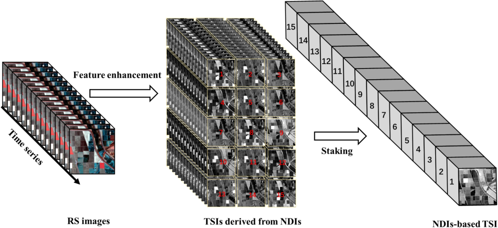

This section will build up the knowledge of GEE from last chapter and focus on using machine learning techniques for land use and land cover change (LULCC) with classification. The following study area in Shenzhen, China will be used for exploring supervised machine learning classification methods (CART and RF) processed through GEE.

## Summary

### Machine Learning

::: {style="border: 1px solid #ddd; border-left: 4px solid #5cb85c; padding: 10px 15px; color: #5cb85c; border-radius: 4px; margin-bottom: 15px;"}
Understand the dynamic nature of landscapes, enabling effective land management strategies, environmental conservation, sustainable planning and policy making [@pande2024; @zhao2024]
:::

#### Study Area: Shenzhen, China

Data was loaded for minimal cloud cover and processed with cloud masking, and through taking the median pixel values across the time series data, where clouds and other atmospheric noises will be removed, leaving raw spectral bands to be used for identifying LULCC.

In this case, 6 land use classes were defined as `urban_low`, `water`, `urban_high`, `grass`, `bare_earth`, and `forest`.

Data was divided into 70% training and 30% testing splits.

::: {#CHUNKNAME layout-ncol="2"}

{#reference}
:::

Random Forest, train test and split pixels –\> give higher accuracy

::: {layout-ncol="1"}

:::

In the final output, I acquired a 11.7% random forest out of bag error estimate and a resubstitution accuracy of 99.7%. However, my validation overall accuracy of 88.1% indicates a 11.6% difference between training and testing which signaled some mild overfitting, I assume it is caused by some spectral confusion between urban and forest pixel values?

GEE code for this practical can be found [here](https://code.earthengine.google.com/0e536642eb70fc39e65513fb5eca24bc).

#### Classification Techniques

There are two main types of classification, supervised and unsupervised.

| Machine Learning | Type | Description | Benefits | Limitations | When to use? |
|----|----|----|----|----|----|
| Classification and Regression Tree (CART) | Supervised | Uses a decision tree using `classifier.smileCart` method | Can handle an enormous size of high resolution datasets without sacrificing processing performance | Prone to overfitting the model; Sensitive to changes in the training datasets which leads to comparably lower accuracy | Land cover (surface water) |
| Random Forest (RF) | Supervised | Generate numerous decision trees by randomly sampling variables and training datasets (often use 20 as a minimum) | High efficiency and accuracy, |  | Land cover (vegetation, urban, barren) environmental monitoring and land management applications |
| Support Vector Machine (SVM) | Supervised |  | Computationally efficient; Works well in high-dimensional areas with distinct margin of separation between classes | Difficult to use, interpret and fine-tune; Require lengthy training period for large datasets, can underestimate urban/ built-up classes | Land cover (surface water) |
| k-means clustering | Unsupervised |  |  |  |  |
| ISODATA |  |  |  |  |  |

: Source: @zhao2024

::: {style="border: 1px solid #ddd; border-left: 4px solid #e0a800; padding: 10px 15px; color: #e0a800; border-radius: 4px; margin-bottom: 15px;"}
**Note that accuracy can be determined by...**

-   Selection of training data size and algorithm used for classification

-   It can be influenced by several factors, such as the choice of classifier, the quality of training data, terrain heterogeneity, dataset used, and the reference maps [@zhao2024].
:::

## Application

The application of machine learning is widely used among remote sensing analysis, typically LULCSS, but studies also incoporate other spectral bands combinations such as NDVI, MNDWI, etc. for training, allowing identifying changes over time. The following shows a workflow for application:

::: {layout-ncol="1"}
{alt="RF Pixel"}
:::

LULCC analysis is essential for understanding environmental, ecological, and societal impacts, where the revolution of GEE, it allows identifying and quantifying LULCC, examing spatial patterns and assessing any temporal changes over time [@pande2024]. –\> can gain insights to the dynamic land use patterns and their implication, which CART can be used to understand the driving factors behind these changes.

The CART model is largely used in land cover classification, taining the model using labeled satellite imagery data can accurately classify land cover classes, such as crops, forests, water bodies, and built-up urban areas [@pande2024].

@dou2021 mentioned using time series images (TSI) to improve classification. It was found that NDI can enhance different classes by making full use of spectral bands, which is used to analyse each temporal image.

::: {layout-ncol="1"}
{alt="RF Pixel"}
:::

## Reflection

How quickly and easily it is to load in vector data of level 2 Global Administrative Units Layers (GAUL) within GEE!!

Information extraction with AI (machine learning)

I also find using Google Earth on the side quite useful to increase the accuracy of drawing polygons.

Establishing and testing an optimal set of complementary textural data for the best possible increase in land use/cover classification accuracy ([Kupidura, 2019](https://www.mdpi.com/2072-4292/11/10/1233#)).

These ML techniques can be useful in tracking urban sprawl, urban heat islands, deforestation, agricultural monitoring. disaster and flood mapping......

Object-based image analysis –\> also a common remote sensing classification –\> look more into it...
