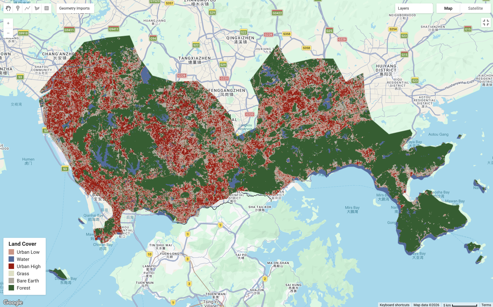
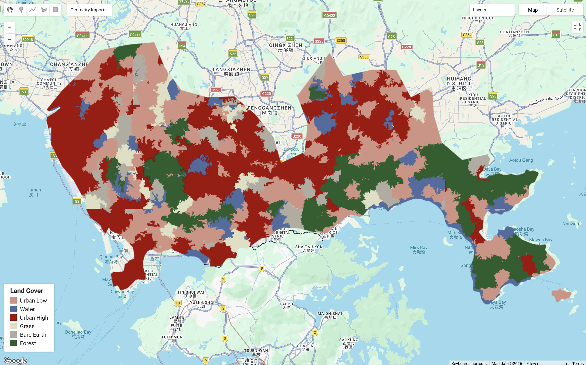
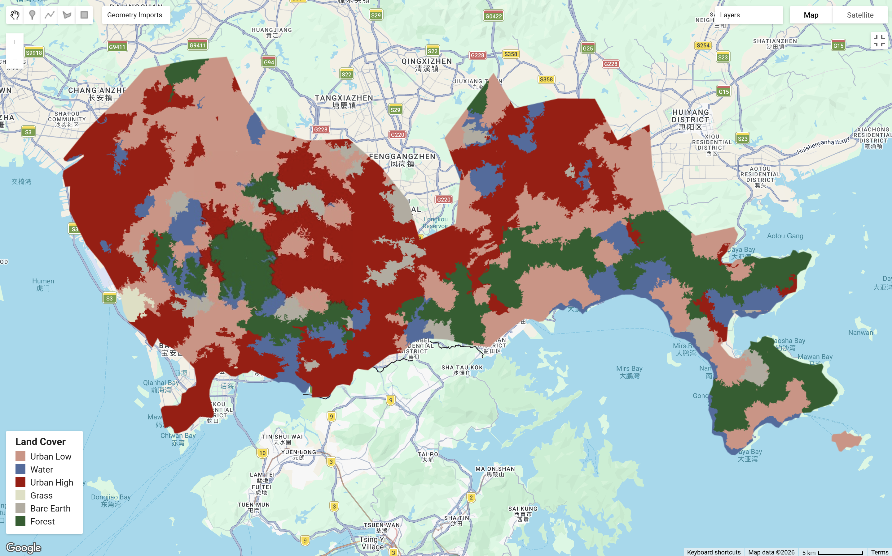

This section will extend on classification algorithms in GEE from last chapter. Focusing on sub-pixel analysis anmd object-based analysis, the following will continue using Shenzhen, China as the study area.

## Summary

### Sub Pixel Analysis

Classification methods face challenges in urban environments because of spatial heterogeneity and spectral similarity between neighboring urban and non-urban land uses. With Landsat’s 30 m spatial resolution, individual pixels often contain mixtures of surfaces such as buildings, roads, and vegetation, which can lead to overestimation of urban land uses[@maclachlan2017]. Sub-pixel analysis addresses this mixed-pixel problem by estimating the fractional proportion of different land cover within each pixel, based on the assumption that land cover composition varies continuously across space [@ge2014]. This method provides a finer representation of land cover and can improve classification accuracy in comparison to assigning each pixel to a defined class. The below shows shenzhen under sub-pixel analysis. In the rapidly urbanising and spatially complex setting of Shenzhen, sub-pixel identifies the degree at which land cover dominates within each pixel, raising accuracy of the landscape.

### Object-Based Image Analysis (OBIA)

OBIA groups similar neighboring pixels as objects. It is found applied frequently for capturing heterogeneity in fragmented urban landscapes. There are three segmentation algorithm that can be implemented with GEE, this includes K-means, G-means and Simple Non-Iterative Clustering (SNIC).

SNIC is an efficient algorithm that groups similar pixels and identify potential, individual objects. It is computation efficient as it cluster pixels based on defined parameters, visits pixels only once and clusters pixels without iterations. Classification is primarily driven by three main parameters of `compactness`, `connectivity` and `neighborhoodSize`[@matarira2023]. Through averaged spectral values, SNIC reduces noise and classification errors.

However, studies have noted that under or overestimation of land cover of Landsat's 30m spatial resolution can persist regardless of the segmentation methods. Therefore OBIA should be understood as improving the representation of spatial heterogeneity rather than correcting for resolution bias. Considering higher resolution imagery such as Sentinel-2 can be a choice, but it is also important to note that there is no method to completely remove heterogeneity.

The below shows Shenzhen under `neighborhoodSize` values of 50 and 256. A smaller neighborhood size can preserve finer details, whereas a larger neighborhood size will show borader clusterings.

::: {#CHUNKNAME layout-ncol="2"}
{alt="CART"}

{#reference alt="RF"}
:::

+-----------------------------+--------------------------------------------------------------------------+--------------------------------------------------------+
| Method                      | Strengths                                                                | Limitations                                            |
+=============================+==========================================================================+========================================================+
| Sub-pixel Analysis          | -   good for mixed pixels                                                | -   noisy-looking output                               |
|                             |                                                                          |                                                        |
|                             | -   good for Landsat                                                     | <!-- -->                                               |
|                             |                                                                          |                                                        |
|                             | -   gives class fractions                                                | -    harder to validate                                |
|                             |                                                                          |                                                        |
|                             | -   useful in messy urban areas                                          | -   harder to explain                                  |
|                             |                                                                          |                                                        |
|                             |                                                                          | -   hardening can reduce the benefits                  |
+-----------------------------+--------------------------------------------------------------------------+--------------------------------------------------------+
| Object-based Image Analysis | -   smoother map                                                         | -   depends on segmentation quality                    |
|                             |                                                                          |                                                        |
|                             | -   easier to interpret                                                  | -   parameters matter                                  |
|                             |                                                                          |                                                        |
|                             | -   uses object features                                                 | -   may merge small details                            |
|                             |                                                                          |                                                        |
|                             | -   often better for final presentation                                  | -   can oversimplify                                   |
|                             |                                                                          |                                                        |
|                             | -   Able to incoporate spectral, spatial and contextual characteristics  | -   Texture analysis may be limited in distinguishment |
|                             |                                                                          |                                                        |
|                             | -   Computationally cheaper, uses less memory (in comparison to k-means) |                                                        |
+-----------------------------+--------------------------------------------------------------------------+--------------------------------------------------------+

### Accuracy Assessment

-   Precision

-   Recall

GEE code for this practical can be found [here](https://code.earthengine.google.com/d2e91e9860c2c56319e3de61bbebb8b0).

## Applications

## Reflection
