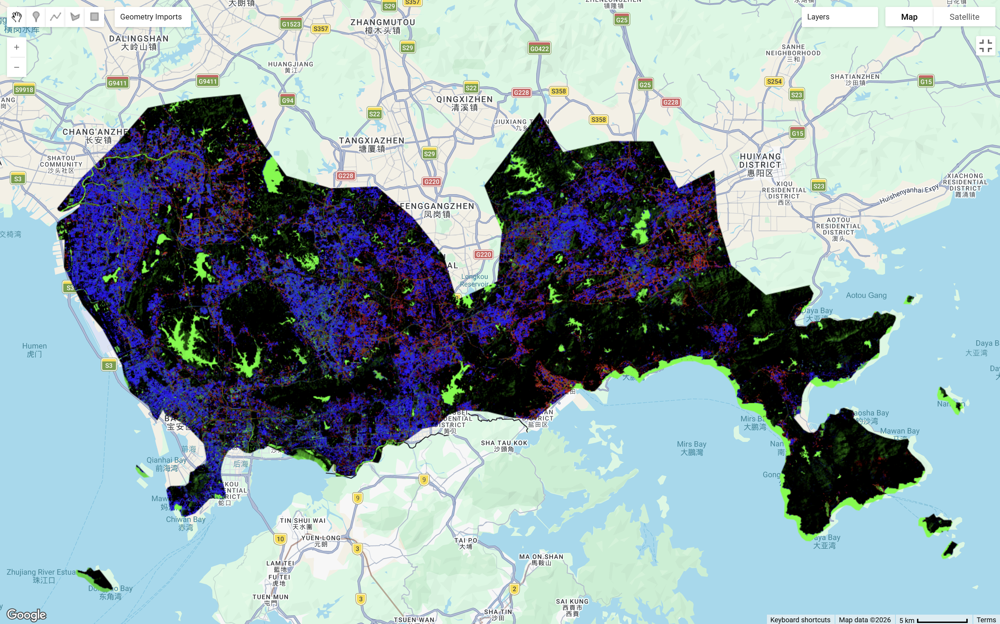

This section will extend on classification algorithms in GEE from last chapter. Focusing on sub-pixel analysis anmd object-based analysis, the following will continue using Shenzhen, China as the study area.

## Summary

### Sub Pixel Analysis

What I found most useful this week was learning that pixel-based classification methods can struggle in urban environments. In a city like Shenzhen, land cover is highly spatially heterogeneous and many neighboring surfaces are spectrally similar. With Landsat’s 30 m spatial resolution, individual pixels often contain mixtures of surfaces such as buildings, roads, and vegetation, which can lead to overestimation of urban land uses [@maclachlan2017]. This made sub-pixel analysis particularly interesting to me, because instead of classifying each pixel into one class, it is able to estimate the fractional composition of land cover within each pixel[@ge2014]. This is especially useful in urban areas, where mixed pixels are unavoidable. Despite, it poses limitations. Although sub-pixel analysis provides a finer representation of land cover, the output can look noisy and harder to interpret, and some of its advantages may be reduced once fractions are hardened into discrete classes. The below shows Shenzhen under sub-pixel analysis:

### Object-Based Image Analysis (OBIA)

OBIA approaches classification differently by grouping neighboring pixels as objects rather than treating each pixel independently. Segmentation methods such as K-means and SNIC showed how classification can incorporate not only spectral information but also spatial and contextual characteristics. SNIC is comparatively more effective as it is computationally efficient and reduces noise through averaging spectral values, yet its performance depends strongly on segmentation parameters such as `compactness`, `connectivity` and `neighborhoodSize`[@matarira2023]. What stood out is that OBIA improves the representation of spatial heterogeneity, however it does not correct resolution biases. This is important to awknowledge as method choice can improve classification, there is no method to completely remove heterogeneity.

The below shows Shenzhen under `neighborhoodSize` values of 50 and 256. The neighbourhood size controls the scale which pixels are groupped into objects in classification. A smaller neighborhood size can preserve finer details, whereas a larger neighborhood size will show borader clustering: \

::: {#CHUNKNAME layout-ncol="2"}

{#reference}
:::

+-----------------------------+------------------------------------------------------------------------------------------+-----------------------------------------------------------------------------------------------------------------------+------------------------------------------------------------------+
| Method                      | Strengths                                                                                | Limitations                                                                                                           | When to use?                                                     |
+=============================+==========================================================================================+=======================================================================================================================+==================================================================+
| Sub-pixel Analysis          | -   Advantageous for complex heterogeneous land cover                                    | -   Perpetuates mixed pixels problem                                                                                  | -   Helpful when using medium resolution imagery (e.g. Landsat)  |
|                             |                                                                                          |                                                                                                                       |                                                                  |
|                             |                                                                                          | -   Fractional classes made it difficult to integrate with GIS                                                        |                                                                  |
|                             |                                                                                          |                                                                                                                       |                                                                  |
|                             |                                                                                          | -   Difficult to compare results across space through time                                                            |                                                                  |
+-----------------------------+------------------------------------------------------------------------------------------+-----------------------------------------------------------------------------------------------------------------------+------------------------------------------------------------------+
| Object-based Image Analysis | -   Able to incorporate spectral, spatial and contextual characteristics to reduce noise | -   Accuracy and quality of these algorithms depends on the type, spatio-temporal and spectral resolution of the data | -   More applicable to high resolution imagery (e.g. Sentinel 2) |
|                             |                                                                                          |                                                                                                                       |                                                                  |
|                             |                                                                                          | -   Impossible for low spatial resolution and difficult for medium spatial resolution imagery                         |                                                                  |
|                             |                                                                                          |                                                                                                                       |                                                                  |
|                             |                                                                                          | -   Can be computation memory intensive especially over large areas or with detailed segmentation                     |                                                                  |
+-----------------------------+------------------------------------------------------------------------------------------+-----------------------------------------------------------------------------------------------------------------------+------------------------------------------------------------------+

: Source: @saba2023, @myint2013

### Accuracy Assessment

The purpose of accuracy assessment is to estimate the error and uncertainty of classification. Resampling procedures such as bootstrapping and cross-validation can be used to estimate map accuracy and associated uncertainty [@lyons2018].

-   **Precision**: Also known as the user's accuracy $\frac{\text{TP}}{\text{TP} + \text{FP}}$, it refers to the proportion of pixels that is classified a class that is actually correct and represents the ground truth.

-   **Recall**: Also known as the producer's accuracy $\frac{\text{TP}}{\text{TP} + \text{FT}}$, it refers to the proportion of pixels that the classification are representing that class in reality.

-   **Overall Accuracy**: Trade-off between **Precision** and **Recall**, they can never be both good as our data is often imbalanced.

-   **F1 score**: The harmonic mean between precision and recall, ranging from 0 to 1 (closer to 1 indicates better performance)

    ::: {style="border: 1px solid #ddd; border-left: 4px solid #d9534f; padding: 10px 15px; color: #d9534f; border-radius: 4px; margin-bottom: 15px;"}
    Note that accuracy assessment do not account for **spatial autocorrelation**!! Achieving a higher overall accuracy score does not always mean that the classification model is better...
    :::

    ::: {style="border: 1px solid #ddd; border-left: 4px solid #5cb85c; padding: 10px 15px; color: #5cb85c; border-radius: 4px; margin-bottom: 15px;"}
    A workflow I will adopt:

    **Class Definition → Pre-processing → Spatial Cross Validation (or Train Test Split) → Pixel Assignment (Sub-pixel ; OBIA) → Accuracy Assessment**

    For now, I am leaning more towards Spatial Cross Validation, because spatial classification seems more likely to provide a more realistic estimate than a simple random train-test split.
    :::

GEE code for this practical can be found [here](https://code.earthengine.google.com/d2e91e9860c2c56319e3de61bbebb8b0).

More on Accuracy Assessment can be found [here](https://mlu-explain.github.io/precision-recall/).

## Applications

### Approaches

Sub-pixel analysis and OBIA have been applied across a range of land cover and monitoring contexts, yet the choice of methods tends to depend on spatial resolution of available imagery.Literature shows that object-based image analysis is often used for understanding urban form in a way that is more meaningful than pixel-by-pixel land-cover labels. Study by @matarira2023 used a Geographic Object-Based Image Analysis (GEOBIA) workflow in GEE to identify informal settlements by integrating Sentinel-1, Sentinel-2 and PlanetScope imagery, showing how texture and object-based spatial context can improve the identification of morphologically complex settlement patterns. This makes OBIA especially useful to understand the spatial pattern and structure of urban areas beyond pure land cover. Similarly, in a study focusing on Local Climate Zone, @ma2021 show that urban climate mapping aims to represent urban surface structure and cover more consistently across cities,. This helps explain why object-based methods are attractive for consistent and comparative climate-sensitive analysis.

Sub-pixel methods are applied more often for needs to estimate continuous urban surface fractions through time series. @zhang2023 developed a seasonal Landsat 8 approach for monitoring subpixel impervious surface dynamics, which is useful because urban change is often gradual and uneven rather than easily divided into fixed classes. Similarly, @li2023 also showed that extracting subpixel vegetation NDVI time series in urban areas can change estimates of vegetation productivity, suggesting that these fractional approaches does not only influences land cover classification but also the environmental indicators derived from it.

So, the key takeaway from the literature is that OBIA is more useful when spatial pattern, morphology, and finer spatial resolution matter, while sub-pixel approaches are more useful to estimate vegetation or impervious fractions from mixed pixels in medium resolution imagery over time.

### GEE Pre-classified Products

Taking it further, there are pre-classified products for public that is easily accessible through the Earth Engine Data Catalog. For land use and land cover change analysis, [Dynamic World V1](https://developers.google.com/earth-engine/datasets/catalog/GOOGLE_DYNAMICWORLD_V1) and [ESA WorldCover 10 m v200](https://developers.google.com/earth-engine/datasets/catalog/ESA_WorldCover_v200#bands) can be used for land classifiers. The [Global Map of Local Climate Zones](https://developers.google.com/earth-engine/datasets/catalog/RUB_RUBCLIM_LCZ_global_lcz_map_latest#bands) (LCZ) adds a different perspective by classifying areas according to urban form and surface structure, which makes it more useful for analysing neighbourhood types, urban morphology and urban climate patterns than simple land-cover. Beyond these, GEE also includes building datasets such as [Open Buildings V3 Polygons](https://developers.google.com/earth-engine/datasets/catalog/GOOGLE_Research_open-buildings_v3_polygons) for building-level analysis and [TIGER: US Census Roads](https://developers.google.com/earth-engine/datasets/catalog/TIGER_2016_Roads) for road data but is limited to the US.

## Reflection

This week made me think much more about what classification is actually claiming to represent. Personally, I think this week will be useful for me in future work because it made me more aware that classification is not just a technical workflow in GEE, but a set of choices with consequences for interpretation, comparison and decision-making. The part I will keep in mind is that accuracy is not only about getting a high score, but about making sure the method matches the spatial reality of the city being studied
