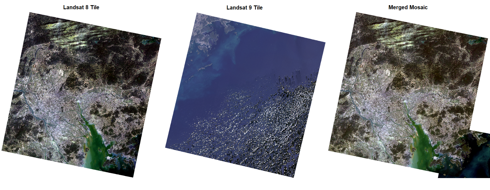

Remotely sensing imagery occasionally requires pre-processing, as sensors may pick up atmospheric effects which may distort the actual surface reflectance from the bottom of atmosphere (BOA). This section will focus on atmospheric correction. The following study area of Hong Kong will demonstrate a workflow of mosiacking Landsat 8-9 tiles and some imagery enhancements processed through R.

## Summary

Two main sources of environmental attenuation is atmospheric scattering and topographic attenuation. As irradiance travels through the atmosphere and reflects back to sensors as radiance, atmospheric absorption and scattering introduces "adjacency effect" which captures radiance from neighboring pixels rather than the target. These distortions can creates haze and reduce contrast in imagery, presenting the need for atmospheric correction to obtain true apparent reflectance.

## Application

### Study Area: Hong Kong

Two satellite tiles were selected from Landsat 8-9 OLI/TIRS C2 L2, Collection 2 and Level 2 is selected for surface reflection (provides surface temperature as well). In this case, two tiles were sufficient to cover the boundaries of Hong Kong. One Landsat 8 and one Landsat 9 tile has been downloaded with \<10% cloud cover between 19th to 20th of March 2025.

Nice hack: draw an area of interest to search for tiles within the boundary for tiles and data preview in EarthExplorer.

::: {layout-ncol="1"}
)](images/w3_images/aoi_landsat89.png)
:::

#### Mosaicking and Data Processing

Merging and joining data sets feathers the images together, which creates seamless mosaic imagery. Below shows the two tiles separately and merged in RGB imagery.

::: {layout-ncol="1"}
{alt="Tiles Selection (Obtained from: [USGS](https://earthexplorer.usgs.gov/))"}
:::

Taking the mosaic imagery, spectral bands. Bands have different wavelengths, Bands 1 to 7 are in 30m resolution where Band 8 is in 15m. More on Landsat Bands can be found in [USGS](https://www.usgs.gov/faqs/what-are-band-designations-landsat-satellites).

::: {layout-ncol="1"}

:::

Hong Kong Planning Districts Boundaries Data were obtained from [Esri China (Hong Kong)](https://opendata.esrichina.hk/maps/7b854e8c055d448a8385f4e693c828d1/explore?location=22.385925%2C114.110150%2C11), which is used to clip the rasters image. This enables further processing in enhancements, looking at certain features or spectral traits, texture and principal component analysis (PCA).

#### Normalised Difference Vegetation Index (NDVI)

The NVDI index is used to highlight healthy vegetation, the following equation is applied:

$$
NDVI = \frac{NIR - Red}{NIR + Red}
$$

Note that... More other ratios can be found in [Index DataBase](https://www.indexdatabase.de/).

::: {#Scatterplot layout-ncol="2"}

:::

#### Texture

::: {layout-ncol="1"}

:::

#### PCA

::: {layout-ncol="1"}

:::

## Reflection
