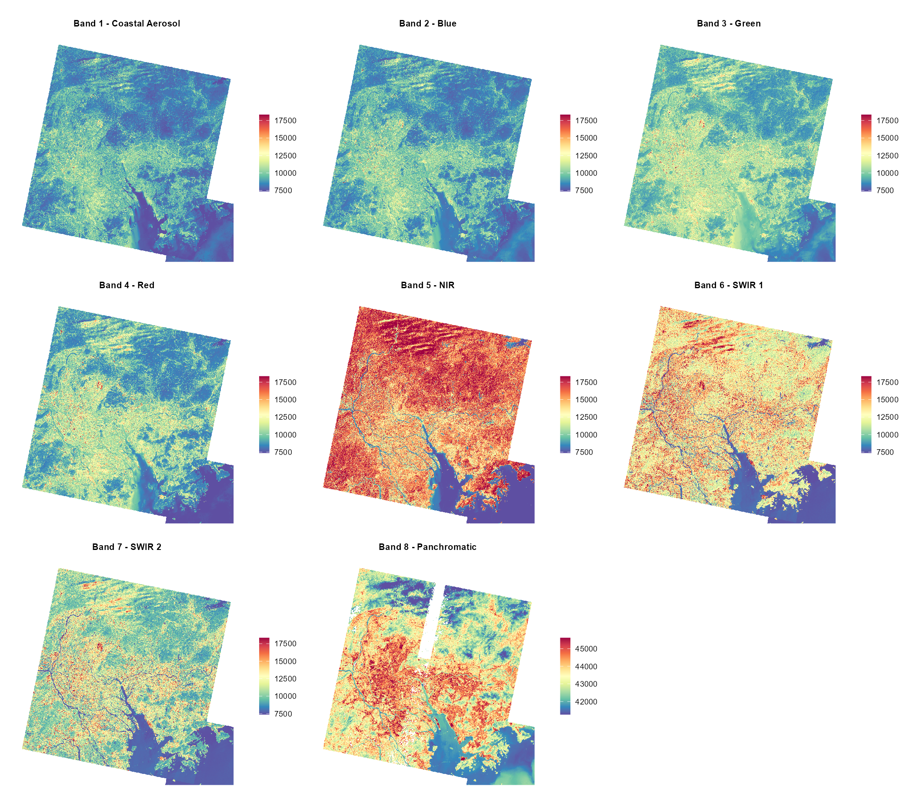
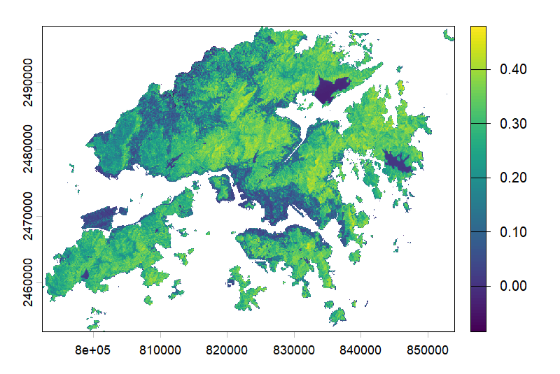
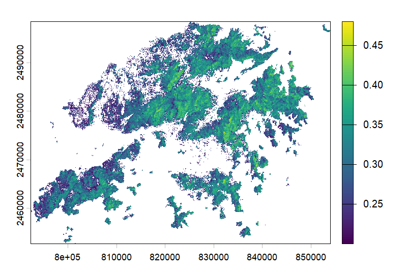
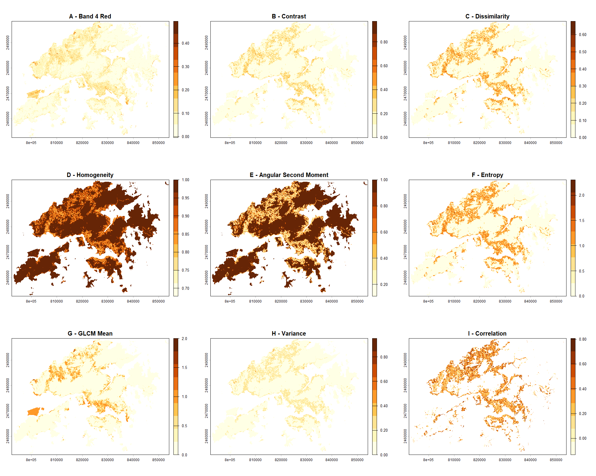
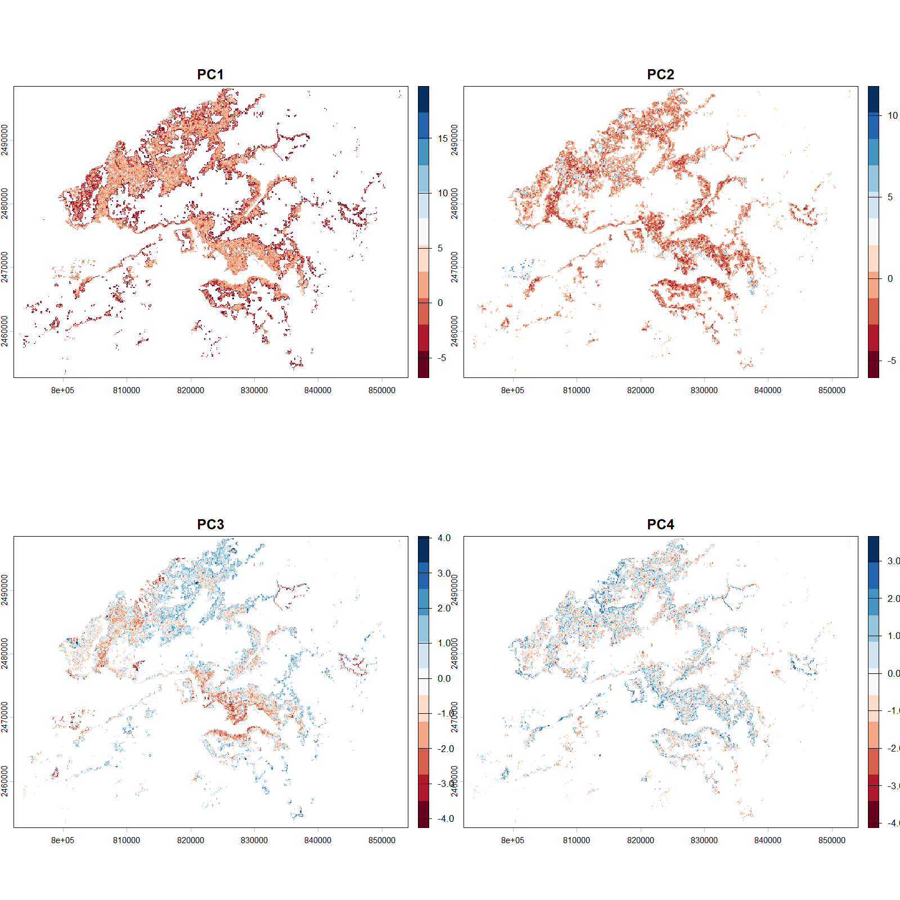
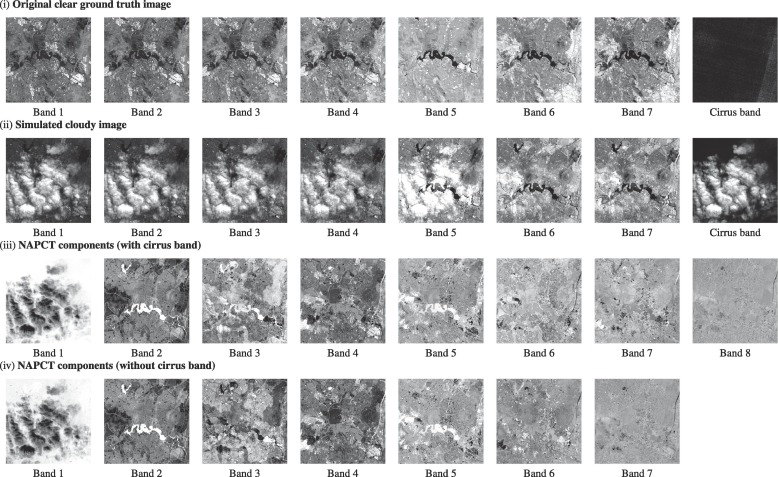

Remotely sensing imagery occasionally requires pre-processing, as sensors may pick up distortions that may affect surface reflectance imagery. This section will focus on correction and enhancements. The following study area of Hong Kong will demonstrate a workflow of mosiacking Landsat 8-9 tiles and imagery enhancements processed through R.

## Summary

Two main sources of environmental attenuation is atmospheric scattering and topographic attenuation. As irradiance travels through the atmosphere and reflects back to sensors as radiance, atmospheric absorption and scattering introduces "adjacency effect" which captures radiance from neighboring pixels rather than the target. These distortions can creates haze and reduce contrast in imagery, presenting the need for atmospheric correction to obtain true apparent reflectance.

Beyond atmospheric correction, remotely sensing data may also require geometric, orthorectification, and radiometric corrections to account for any sensor distortions, displacement, and calibration errors. The following discuss the 5 key types of corrections.

#### Types of Correction

+---------------------------------------------+-------------------------------------------------------------------------------------------------------------------------------------------------------------------------------------------------+--------------------------------------------------------------------------------------------------------------+---------------------------------------------------------------------------------------------------------------------+-------------------------------------------------------------------------------------------------------------------------------------+
| Correction                                  | Description                                                                                                                                                                                     | Benefits                                                                                                     | Limitations                                                                                                         | When to use?                                                                                                                        |
+=============================================+=================================================================================================================================================================================================+==============================================================================================================+=====================================================================================================================+=====================================================================================================================================+
| Geometric Correction                        | Correct positional distortions from off-nadir view angles, topography, wind, earth shape and rotation                                                                                           | Aligning with Ground Control Points (GCPs) allows high accuracy                                              | Time consuming; Computational intensive                                                                             | Compared with data or maps; Calculation of distances or area; Two images acquired at different dates to be compared pixel by pixel. |
+---------------------------------------------+-------------------------------------------------------------------------------------------------------------------------------------------------------------------------------------------------+--------------------------------------------------------------------------------------------------------------+---------------------------------------------------------------------------------------------------------------------+-------------------------------------------------------------------------------------------------------------------------------------+
| Atmospheric Correction                      | Removes atmospheric effects;                                                                                                                                                                    | Removes haze and adjacency effects                                                                           | May not remove all atmospheric effects completely                                                                   | Need to acquire biophysical parameters (e.g. temperature, NDVI); Using spectral signatures through time and space                   |
|                                             |                                                                                                                                                                                                 |                                                                                                              |                                                                                                                     |                                                                                                                                     |
|                                             | Methods: Dark Object Subtraction (DOS); Psuedo-invariant Features (PIFs)                                                                                                                        |                                                                                                              |                                                                                                                     |                                                                                                                                     |
+---------------------------------------------+-------------------------------------------------------------------------------------------------------------------------------------------------------------------------------------------------+--------------------------------------------------------------------------------------------------------------+---------------------------------------------------------------------------------------------------------------------+-------------------------------------------------------------------------------------------------------------------------------------+
| Empirical Line Correction                   | Uses field spectrometer for measurements taken during satellite overpass                                                                                                                        | Provide a simple surface reflectance calibration: available invariant-in-time calibration target measurement | Requires physical field measurement to be done exactly timed with satellite overpasses; Hazards may present on site | To obtain accurate and precise surface refection                                                                                    |
+---------------------------------------------+-------------------------------------------------------------------------------------------------------------------------------------------------------------------------------------------------+--------------------------------------------------------------------------------------------------------------+---------------------------------------------------------------------------------------------------------------------+-------------------------------------------------------------------------------------------------------------------------------------+
| Orthorectification (Topographic) Correction | Assign coordinates to an image (Georectification) and Orthorectification goes beyond in removing distortions (influences of topography), ensuring pixels are as if depicted from directly above | Allow accuracy for terrain areas through removing terrain displacements                                      | Require an accurate and high resolution digital elevation model (DEM)                                               | For areas with complex terrain                                                                                                      |
|                                             |                                                                                                                                                                                                 |                                                                                                              |                                                                                                                     |                                                                                                                                     |
|                                             |                                                                                                                                                                                                 |                                                                                                              |                                                                                                                     | (Note\* Should be used after atmospheric correction)                                                                                |
+---------------------------------------------+-------------------------------------------------------------------------------------------------------------------------------------------------------------------------------------------------+--------------------------------------------------------------------------------------------------------------+---------------------------------------------------------------------------------------------------------------------+-------------------------------------------------------------------------------------------------------------------------------------+
| Radiometric Calibration                     | Convert Digital Numbers (DN) to spectral radiance                                                                                                                                               | Allow comparison across sensors across different acquisition dates                                           |                                                                                                                     | To convert the output signal into physical magnitudes (e.g. radiance, reflectivity, temperature)                                    |
+---------------------------------------------+-------------------------------------------------------------------------------------------------------------------------------------------------------------------------------------------------+--------------------------------------------------------------------------------------------------------------+---------------------------------------------------------------------------------------------------------------------+-------------------------------------------------------------------------------------------------------------------------------------+

Sources: @green2000, @karpouzli2003, @m.shimada2010, @radiomet, [CASA0023](https://andrewmaclachlan.github.io/CASA0023/)

Overall, atmospheric and topographic corrections are particularly important for study areas with complex conditions and morphology, yet the most suitable correction method depends on data availability and the purpose of analysis.

## Application

**Study Area: Hong Kong**

Landsat 8-9 OLI/TIRS Collection 2 Level-2 data were a good choice here as they equip surface reflectance, where no additional atmospheric correction is needed. \<10% cloud coverage was used, but in a place where atmospheric moisture is common, haze, cloud, and different date acquisition between tiles could still be a problem.

::: {layout-ncol="1"}
)](images/w3_images/aoi_landsat89.png)
:::

### Mosaicking and Data Processing

Mosaicking was necessary as Hong Kong extends across two tiles. Feathering joins two images together, but not completely "seamless". This is likely due to acquisition differences, cloud contamination, or differing radiometric conditions, highlighting that mosaicking can improve spatial coverage but cannot fully resolve inconsistencies between tiles.

::: {layout-ncol="1"}
)](images/w3_images/rgb_merge_comparison.png)
:::

The plot below compares spectral behaviours across different surface features. Each band operates at different wavelengths, Bands 1–7 at 30m resolution and Band 8 at 15m. However, mixed urban surfaces and terrain can produce complex spectral responses, so single-band interpretation is limited without further complementary analysis. For example, @wang2008 noted that SWIR responds highly to both soil moisture and leaf water content, where combining NIR and SWIR are useful in detecting vegetation moisture conditions, and distinguishing land uses types. More about Landsat bands: [USGS](https://www.usgs.gov/faqs/what-are-band-designations-landsat-satellites).

::: {layout-ncol="1"}

:::

### Normalised Difference Vegetation Index (NDVI)

Moving beyond, here will use a combination of bands for NDVI, to highlight healthy vegetation:

$$
NDVI = \frac{NIR - Red}{NIR + Red}
$$

\
Healthy vegetation strongly reflects NIR while absorbing Red through photosynthesis, making the NDVI ratio an effective vegetation health indicator. Atmospheric correction is important here as haze and scattering can distort red and NIR reflectance, reducing NDVI reliability. More on other ratios: [Index DataBase](https://www.indexdatabase.de/).

::: {#Scatterplot layout-ncol="2"}



:::

### Texture

Texture captures the spatial relationships between neighboring pixels, highlighting different land surfaces' distinct structural patterns (e.g. bumpiness, smoothness, jaggedness). Band 4 Red is often used for texture analysis as urban surfaces and vegetation respond very differently to Red wavelengths. This approach have been widely used for land use and land cover classification. It was found that it can significantly increase [classification](https://christychoicc.github.io/RSCE/classification-2.html) accuracy, therefore, best practices often combine texture and spectral analysis for obtaining the best results [@kupidura2019].

Grey-level-co-occurence matrix (GLCM) measures relationships between neighbouring pixel pairs at a certain distance and is commonly used for highlighting texture:

$$
\rho = (\text{pixel\_value} \times 0.0000275) - 0.2
$$

::: {layout-ncol="1"}

:::

However, it may not always be most suitable. As mentioned by @kupidura2019, GLCM may distort classification when it comes into an "edge effect". Given this, GEE is valuable because it enables texture exploration, but methodological choice still remains an important consideration.

### PCA

PCA allows reduction of multi-spectral data into uncorrelated, smaller dimensions while retaining most of the imagery information. Our summary of 8 spectral bands and 8 texture variables shows:

```{r, echo=FALSE}
cat(readLines("correction/pca_summary.txt"), sep = "\n")
```

+----------------------------------+--------------------------------------------------------+
| Components                       | Explaination                                           |
+==================================+========================================================+
| Standard Deviation               | Spread of data                                         |
+----------------------------------+--------------------------------------------------------+
| Proportion of Variance           | Proportion of data retained from the original data set |
+----------------------------------+--------------------------------------------------------+
| Cumulative Proportion            | Proportion of total variance of the original data set  |
+----------------------------------+--------------------------------------------------------+

In this case, PC1 to PC4 explains most of the variations, 91% of spectral variance can be identified in the first 4 principle components. This is very helpful as it allows higher efficiency in analysis, including most of total variance while reducing 16 layers to 4 without loosing much information.

| Component             |    PC1 |    PC2 |     PC3 |     PC4 |
|-----------------------|-------:|-------:|--------:|--------:|
| Cumulative Proportion | 0.4981 | 0.7629 | 0.85152 | 0.91729 |

::: {layout-ncol="1"}

:::

PCA is useful for simplifying image data and showing main patterns, but it does not directly remove cloud contamination. Extending on PCA, @xu2019 proposed noise-adjusted principal components transform (NAPCT) for thin cloud removal. Intrestingly, cloud-contaminated pixels actually have the highest signal-to-noise ratio due to spatial variation, where NAPCT can isolate them into the first component (NAPC1). Applying an inverse transformating of without NAPC1 will produce a cloud-free image.



## Reflection

There is a lot of contents in data correction and enhancements, yet they are fundamental to ensure reliability, accuracy and comparability within remotely sensing analysis. Luckily, there is now open acess to Level 2 data that are analysis ready data (ARD), no extensive manual correction process needed. More on Level 2 data can be found in the following, click for [Sentinel](https://www.earthdata.nasa.gov/learn/earth-observation-data-basics/data-processing-levels) and [Landsat](https://www.usgs.gov/landsat-missions/landsat-collection-2-level-2-science-products).

GLCM Texture and PCA analysis were the most insightful sections in this section. It was very interesting to see visually that combinations of spectral and structural information can reveal spatial patterns that enables accurate classification of land cover rather than just relying information derived from one spectral band only. One limitations in this application workflow is that it is time consuming and computational intensive, which this will be improved using Google Earth Engine which will be covered later.

I have always choose [GADM](https://gadm.org/) for obtaining adminstrative boundaries, however it lacks coverage for special administrative regions like Hong Kong. This has given me opportunities to explore on broader range of reliable alternative boundary sources, in Hong Kong's case, [Esri China (Hong Kong)](https://opendata.esrichina.hk/maps/7b854e8c055d448a8385f4e693c828d1/explore?location=22.385925%2C114.110150%2C11).

Having lived in Hong Kong for many years, I have never looked at the city through a remote sensing perspective. This has been a very interesting study area both personally and scientifically. It is comprised of one of the world's most dense urban form while having about three quarters of land covered in vegetation, offering a unique juxtaposition of dense urban form with natural landscape packed within a small land area [@gov.hk2013]. Furthermore, there is presence of a mixed range of green infrastructure within the densely built city, and there are growing trends of vertical greenery systems on building facades. This has questioned whether nadir imagery from conventional EO data may undermine full vegetation coverage. For such complex environments, the approaches above may not be the most suitable approach for precision, but it has provided a reliable indicator of overall vegetation coverage and identifying terrain structures despite finer-scale green infrastructure to be harder to capture. Overall, the workflow covered in this section is strongly transferable and applicable across a range of study contexts, it is important to note that choosing the right sensor that suits the specific application remains critical for producing meaningful results.
