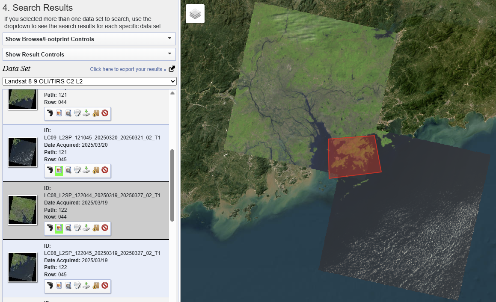

This section will discuss about atmospheric correction. The following study area of Hong Kong will demonstrate a workflow of correction of Landsat 8-9 OLC... processed through R.

## Summary

Two main sources of environmental attenuation is atmospheric scattering and topographic attenuation. As irradiance travels through the atmosphere and reflects back to sensors as radiance, atmospheric absorption and scattering introduces "adjacency effect" which captures radiance from neighboring pixels rather than the target. These distortions can creates haze and reduce contrast in imagery, indicating the need for atmospheric correction to obtain true apparent reflectance.

## Application

### Study Area: Hong Kong  

::: {layout-ncol="1"}
{alt="Remote Sensing Resolutions (Source: NASA EARTHDATA)"}
:::

::: {layout-ncol="1"}
{alt="Remote Sensing Resolutions (Source: NASA EARTHDATA)"}
:::

::: {#Scatterplot layout-ncol="2"}
{alt="Sentinel Band 4 and Band 8 Scatterplot"}

{alt="Landsat Band 4 and Band 5 Scatterplot"}
:::

::: {layout-ncol="1"}
{alt="Remote Sensing Resolutions (Source: NASA EARTHDATA)"}
:::

::: {layout-ncol="1"}
{alt="Remote Sensing Resolutions (Source: NASA EARTHDATA)"}
:::

## Reflection
