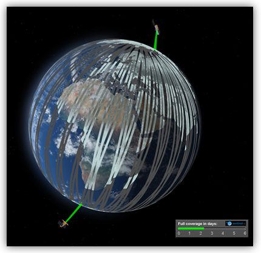
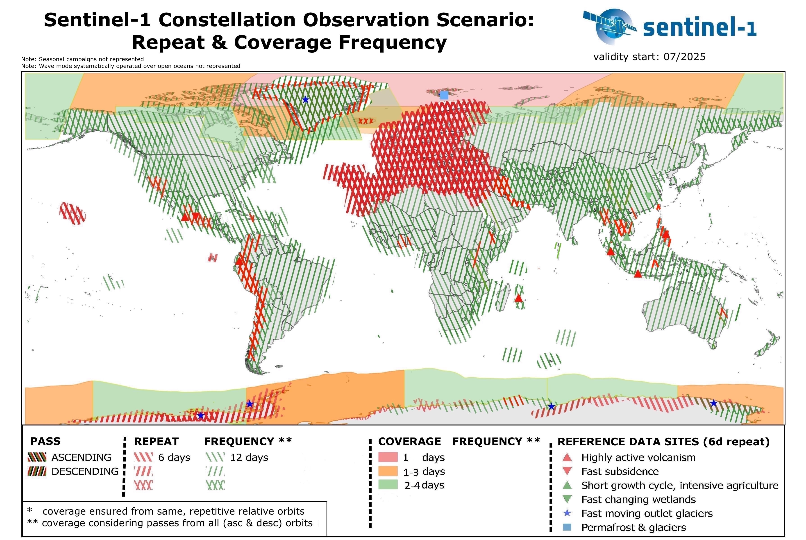
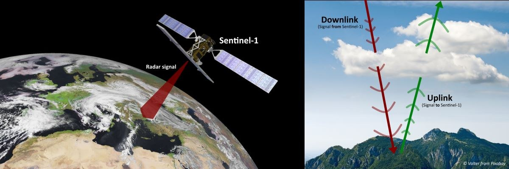

```{r setup, include=FALSE}
library(RefManageR)
BibOptions(check.entries = FALSE,
           bib.style = "authoryear",
           cite.style = "authoryear",
           style = "markdown",
           hyperlink = TRUE,
           dashed = FALSE,
           no.print.fields=c("doi", "url", "urldate", "issn"))
myBib <- ReadBib("../references.bib", check = FALSE)
```

```{r xaringan-themer, include=FALSE, warning=FALSE}
library(xaringanthemer)

style_mono_light(
  base_color = "#2c3e50",
  background_color = "#fafafa",
  header_font_google = google_font("Libre Baskerville"),
  text_font_google   = google_font("Libre Baskerville"),
  code_font_google   = google_font("Fira Code"),
  base_font_size = "16px",
  header_h1_font_size = "2.2rem", # Was likely ~2.5-3rem by default
  header_h2_font_size = "1.8rem",
  header_h3_font_size = "1.4rem",
  extra_css = list(
    # Title (h1)
    ".title-slide h1" = list(
      "font-size" = "40px",
      "margin-bottom" = "15px"
    ),
    # Subtitle (h2)
    ".title-slide h2" = list(
      "font-size" = "28px",
      "margin-top" = "0px",
      "margin-bottom" = "30px"
    ),
    # Author, Institute, Date (h3)
    ".title-slide h3" = list(
      "font-size" = "18px",
      "font-weight" = "normal",
      "margin-bottom" = "10px"
    )
  )
)
```

# What is Sentinel-1? 
.pull-left[
* A polar orbiting two satellite constellation that carries C-band synthetic aperture radar (C-SAR)

* Able to acquire data under day-and-night, all weather and atmospheric conditions

* Able to capture land, ice, and coastal zones data with high and medium resolutions

* Launched by the European Space Agency (ESA) under the Copernicus Program to acquire environment and security data
]

.pull-right[
```{r, echo=FALSE, out.width='100%', fig.align='right'}
# Add a sentinel-1 picture
# Source: https://sentiwiki.copernicus.eu/web/sentinel-1
knitr::include_graphics("../images/w2_images/sentinel-1.jpg")
```
<p style="font-size: 0.6em; text-align: center; margin-top: 0;">
Figure 1: Sentinel-1 (Source: <a href="https://sentiwiki.copernicus.eu/web/sentinel-1">SentiWiki Copernicus</a>)
</p>
]

---

# Mission of Sentinel-1C
```{r tech-setup, include=FALSE}
# Panel settings
library(xaringanthemer)
library(xaringanExtra)

options(htmltools.dir.version = FALSE)
# Load xaringanExtra for the tabs
style_extra_css(css = list(
  ".pull-left-3" = list("float" = "left", "width" = "30%"),
  ".pull-middle-3" = list("float" = "left", "width" = "30%", "margin-left" = "5%", "margin-right" = "5%"),
  ".pull-right-3" = list("float" = "right", "width" = "30%"),
  ".pull-left-4" = list("float" = "left", "width" = "22%"),
  ".pull-mid1-4" = list("float" = "left", "width" = "22%", "margin-left" = "4%"),
  ".pull-mid2-4" = list("float" = "left", "width" = "22%", "margin-left" = "4%"),
  ".pull-right-4" = list("float" = "right", "width" = "22%")
))
xaringanExtra::use_panelset()
```

Launched on 5 December 2024, Sentinel-1C reestablished a two-satellite constellation orbiting 180° apart for extensive worldwide coverage by May 2025 with technical upgrades. SAR allows continuous monitoring and provides consistent long-term data for time-series analysis.

### Key Mission Objectives and Applications 
<div style="font-size: 10px; margin-top: -15px; margin-bottom: 15px; color: #555;">
Reference: <a href="https://www.earthdata.nasa.gov/data/platforms/space-based-platforms/sentinel-1">NASA EARTHDATA</a> , <a href="https://sentiwiki.copernicus.eu/web/s1-applications#S1Applications-OverviewofS1Applications">SentiWiki Copernicus</a>
</div>

.panelset[
.panel[.panel-name[Land Monitoring]
<div style="font-size: 14px;">
.pull-left-3[
#### Forestry
* **Role**: Forest Type Classification, Biomass Estimation, Disturbance Detection

* **Climate Change**: Trace Forest Carbon History, Estimate Carbon Emissions

* **Land Cover**: Support forest management, Monitor illegal timber harvesting activities
]

.pull-middle-3[
#### Agriculture

* **Crop Production**: Conditions, Harvest Prediction, Monitor Seasonal Changes, Pastures Productivity, Drought Impacts

* **Soil**: Soil Properties, Degradation, Land Productivity, Tillage Activities

]

.pull-right-3[
#### Urban Deformation Mapping

* **Land Subsidence**: Detect surface movements

* **Infrastructure**: Detect Structural Damage to Infrastructures (e.g. Buildings) and Underground Conditions

* **Disaster**: Assess Damage/ Devastation After Events (e.g. Explosion)
]
<div style="clear:both"></div>

</div>
]

.panel[.panel-name[Maritime Monitoring]
<div style="font-size: 14px;">
.pull-left-4[
#### Ice

* **Identification**: Type, Thickness, Size, Density, Orientation, Location

* **Navigation in Ice-Covered Zones**

]

.pull-mid1-4[
#### Ship

* **Cooperative System**: Uses AIS to Detect, Classify, Trace and Locate Vessels

]

.pull-mid2-4[
#### Oil Pollution

* **Prosecution**: Oil Detection from Illegal discharges, Spills Spread, Naturally Seepage with AIS information

]

.pull-right-4[
#### Oceanography

* **Weather Prediction**: Storm and Cyclone

* **Coastal**: Marine Waves, Ocean Currents and Sea Surface Winds

* **Wave Energy**

]

<div style="clear:both"></div>

</div>
]

.panel[.panel-name[Emergency Management]
<div style="font-size: 14px;">
.pull-left-3[
#### Flood Monitoring

* **Hydrology**: Run-off and Inundation Analysis 

* **Vegetation**: Detect Flooded Vegetation

]

.pull-middle-3[
#### Earthquake Analysis

* **Earthquake Deformation Mapping**

* **Identify Potential Risks**: Discover Active Fault Lines from Persistent Monitoring

* **Large-scale Monitoring Earthquakes**

]

.pull-right-3[
#### Landslide and Volcano Monitoring

* **Identify Potential Warnings**: Monitor Surface Deformation, Identify First Signs of Volcanic Activity, Preceding Earthquakes, Pre-eruption Uplift, Quantify Ground Deformation, Post Eruption Volcanic Shrinkage

]
<div style="clear:both"></div>

</div>
]
]


---

# Technical Specifications
.pull-left[
.panelset[
.panel[.panel-name[Resolution]
* Spatial Coverage: Worldwide

* Spatial Resolution: 25x40m, 5x5m, and 5x20m

* Spectral Resolution: C-band radar at 5.405 GHz

* Temporal Coverage: 
  * Global revisit bi-weekly (interval of 12 Days)
  * Repeat frequency of 6 days with two-satellites constellation
  * 175 orbits per cycle per satellite
  * Revisit rates higher in areas with higher latitude (e.g. < 1 day at Arctic, ~ 2 days at Europe)

<div style="font-size: 10px; margin-top: 20px; color: #555;">
Reference: <a href="https://sentiwiki.copernicus.eu/web/sentiwiki">SentiWiki</a> , <a href="https://www.earthdata.nasa.gov/data/instruments/sentinel-1-c-sar#:~:text=Instrument%20Type,Frequently%20Asked%20Questions">NASA EARTHDATA</a> , <a href="https://www.sciencedirect.com/science/article/pii/S0034425712000600">Torres. et.al, 2012</a>
</div>]

.panel[.panel-name[Specifications]

* Orbital Altitude: 693 km

* Sensor Complement: C-SAR

* Operative autonomy: 96 hours

* Data Delivery: 24 hours

* Lifespan: 7.25 years (consumables for 12 years)

<div style="font-size: 10px; margin-top: 20px; color: #555;">
Reference: <a href="https://www.eoportal.org/satellite-missions/copernicus-sentinel-1#spacecraft">eoPortal</a>
</div>

] ] ] .pull-right[
```{r, echo=FALSE, out.width='280px', fig.align='center'}
# Add a sentinel-1 constellation 
# Source: https://sentiwiki.copernicus.eu/web/s1-mission

```
<p style="font-size: 0.6em; text-align: center; margin-top: -10px; margin-bottom: 20px;">
Figure 2: Sentinel-1 Constellation (Source: <a href="https://sentiwiki.copernicus.eu/web/s1-mission">SentiWiki Copernicus</a>)
</p>

```{r, echo=FALSE, out.width='280px', fig.align='center'}
# Add a ground range detection picture 
# Source: https://sentiwiki.copernicus.eu/web/s1-mission

```
<p style="font-size: 0.6em; text-align: center; margin-top: -10px;">
Figure 3: Sentinel-1 Repeat Coverage Frequency (Source: <a href="https://sentiwiki.copernicus.eu/web/s1-mission">SentiWiki Copernicus</a>)
</p>
]

---

# Benefits and Limitations 

.panelset[

.panel[.panel-name[Benefits]

```{r, echo=FALSE, out.width='80%', fig.align='center'}
# Add a C-Band Radar Operation picture 
# Source: https://land.copernicus.eu/en/feature-articles/sentinel-1c-secures-the-future-of-radar-data

```
<p style="font-size: 0.6em; text-align: center; margin-top: -10px;">
Figure 4: (Left) Sentinel-1 C-Band Radar transmit signals to the Earth surface. (Right) Radar passes through clouds (red), and depicts signals reflected from Earth's surface back to the satellite.   (Source: <a href="https://land.copernicus.eu/en/feature-articles/sentinel-1c-secures-the-future-of-radar-data">NASA Earthdata</a>)
</p>

* **Free and Open Data**
* **Consistent, High-Resolution, Quality, Reliable Data**
* **Accessibility**: Timely and Accurate Data
* **Improved Technical Instruments**: Upgraded radar imaging and design to withstand space debris 
* **C-band radar**
  * Ability to penetrate through clouds, and vegetation but to a lesser extent
  * Able to deliver consistent and reliable data under conditions
* **Two-satellite constellation** allow passing over same areas at the same time each orbital cycle

<div style="font-size: 10px; margin-top: 20px; color: #555;">
Reference: <a href="https://land.copernicus.eu/en/feature-articles/sentinel-1c-secures-the-future-of-radar-data">Copernicus</a>
</div>

]

.panel[.panel-name[Limitations]

* **Extensive pre-processing required**: GRD data require pre-processing procedure of noise removal before analysis ([Boemke, et.al, 2023](https://www.sciencedirect.com/science/article/pii/S1875963723000241))

* SAR operates at shorter wavelengths, therefore exhibits shallower penetration depth and interacts primarily with the upper canopy layer ([Gupta, et.al, 2026](https://www.sciencedirect.com/science/article/pii/S2666017226000155))

* Limited capabilities for topographic mapping based on stereoscopic methods applied to the amplitude ([Braun, 2021](https://www.degruyterbrill.com/document/doi/10.1515/geo-2020-0246/html)


* There maybe areals of low coherence between the sensor and the area may limit interferometric approaches ([Boemke, et.al, 2023](https://www.sciencedirect.com/science/article/pii/S1875963723000241))


]]
---

# Land Monitoring 
### Crop Monitoring: A Case Study of the Netherlands ([Khabbazan,et.al, 2019](https://www.mdpi.com/2072-4292/11/16/1887))
.pull-left[
* **Purpose**
  * Monitor growth and development of crops

* **Why and How?**
  * SAR ensured quality, reliability of data, meeting monitoring needs
  * Low frequency radar suitable for sensing soil moisture, water content and structural changes in agricultural crops
]

.pull-right[

IMAGE!!!

]

---

# Maritime Monitoring


---

# Emergency Response Management


---

# Reflection


