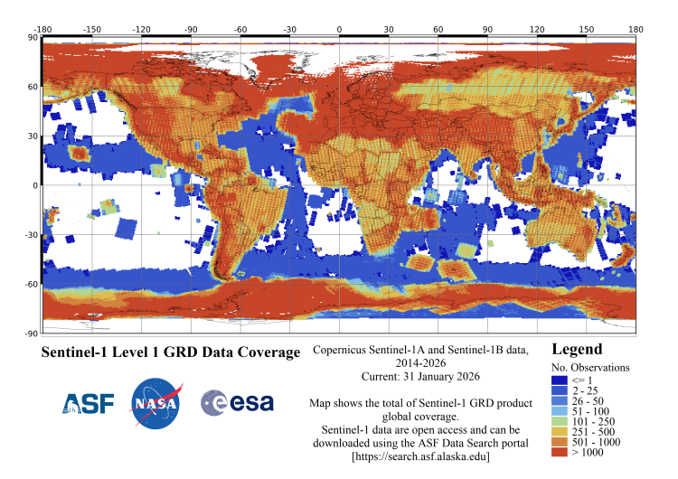

```{r setup, include=FALSE}
library(RefManageR)
BibOptions(check.entries = FALSE,
           bib.style = "authoryear",
           cite.style = "authoryear",
           style = "markdown",
           hyperlink = TRUE,
           dashed = FALSE,
           no.print.fields=c("doi", "url", "urldate", "issn"))
myBib <- ReadBib("../references.bib", check = FALSE)
```

```{r xaringan-themer, include=FALSE, warning=FALSE}
library(xaringanthemer)

style_mono_light(
  base_color = "#2c3e50",
  background_color = "#fafafa",
  header_font_google = google_font("Libre Baskerville"),
  text_font_google   = google_font("Libre Baskerville"),
  code_font_google   = google_font("Fira Code"),
  base_font_size = "16px",
  header_h1_font_size = "2.2rem", # Was likely ~2.5-3rem by default
  header_h2_font_size = "1.8rem",
  header_h3_font_size = "1.4rem",
  extra_css = list(
    # Title (h1)
    ".title-slide h1" = list(
      "font-size" = "40px",
      "margin-bottom" = "15px"
    ),
    # Subtitle (h2)
    ".title-slide h2" = list(
      "font-size" = "28px",
      "margin-top" = "0px",
      "margin-bottom" = "30px"
    ),
    # Author, Institute, Date (h3)
    ".title-slide h3" = list(
      "font-size" = "18px",
      "font-weight" = "normal",
      "margin-bottom" = "10px"
    )
  )
)
```

# What is Sentinel-1? 
.pull-left[
* A polar orbiting two satellite constellation that carries C-band synthetic aperture radar (C-SAR)

* Able to acquire data under day-and-night, all weather and atmospheric conditions
]

.pull-right[
```{r, echo=FALSE, out.width='100%', fig.align='right'}
# Add a sentinel-1 picture
# Source: https://sentiwiki.copernicus.eu/web/sentinel-1
knitr::include_graphics("../images/w2_images/sentinel-1.jpg")
```
]

---

# Mission of Sentinel-1


---

# Technical Specifications
```{r tech-setup, include=FALSE}
options(htmltools.dir.version = FALSE)
# Load xaringanExtra for the tabs
xaringanExtra::use_panelset()
```
.pull-left[
.panelset[
.panel[.panel-name[Resolution]
* Spectral Resolution: 1nm - 180nm

* Temporal Coverage: Global revisit bi-weekly (interval of 12 Days)

]
.panel[.panel-name[Applications]
* bullet points

] ] ] .pull-right[
The below shows the total coverage of Sentinel-1 Ground Range Detected (GRD) from 2014 to January 2026.
```{r, echo=FALSE, out.width='100%', fig.align='right'}
# Add a ground range detection picture 
# Source: https://www.earthdata.nasa.gov/data/platforms/space-based-platforms/sentinel-1

```
]

---

# Benefits and Limitations 

---

# Application 1

---

# Application 2

---

# Application 3

---

# Reflection

