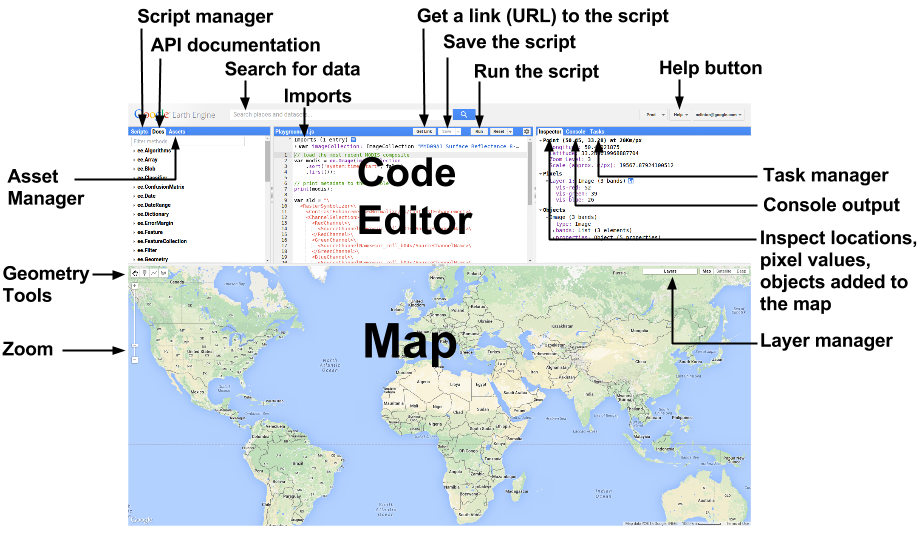
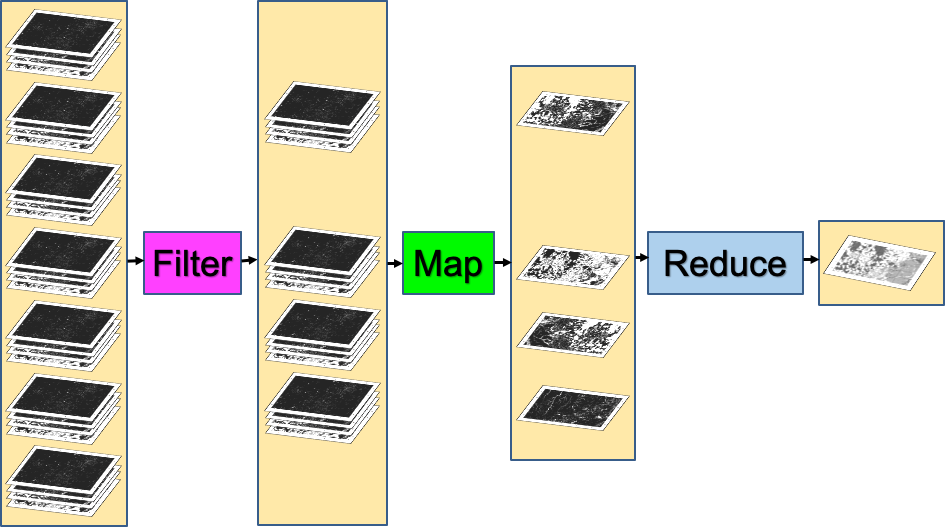
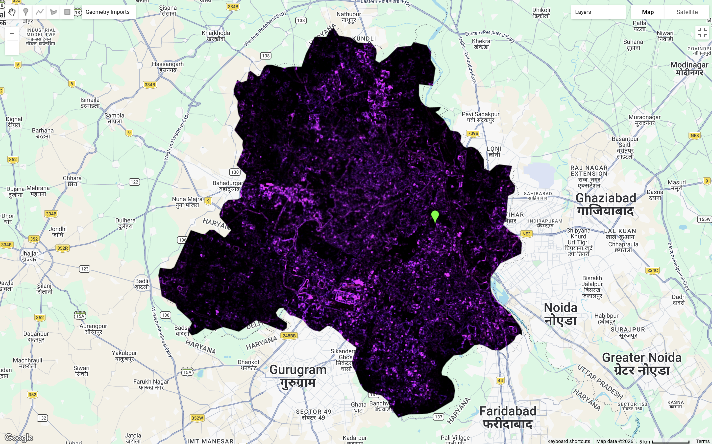
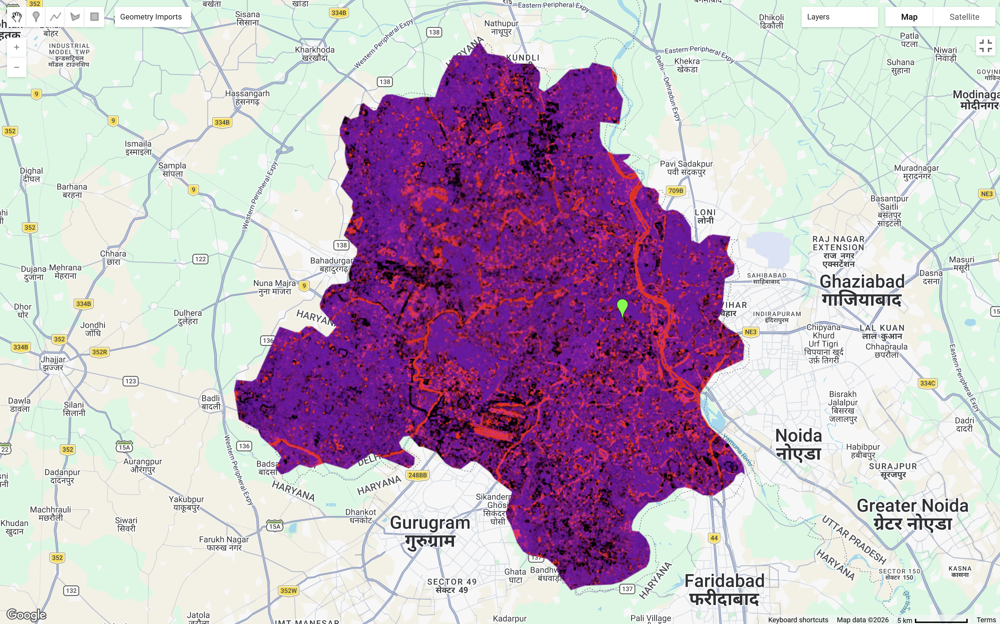
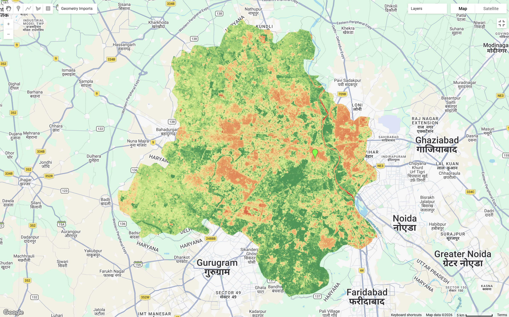
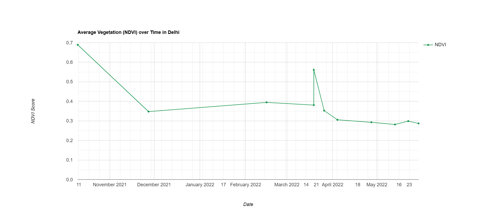
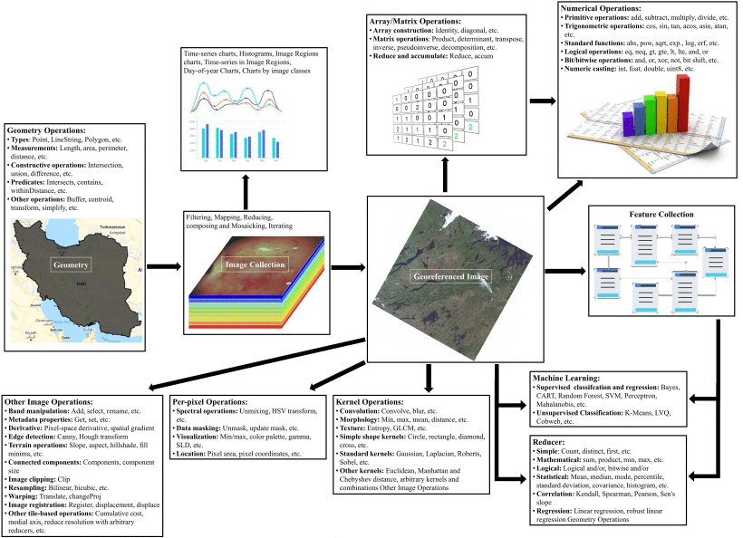
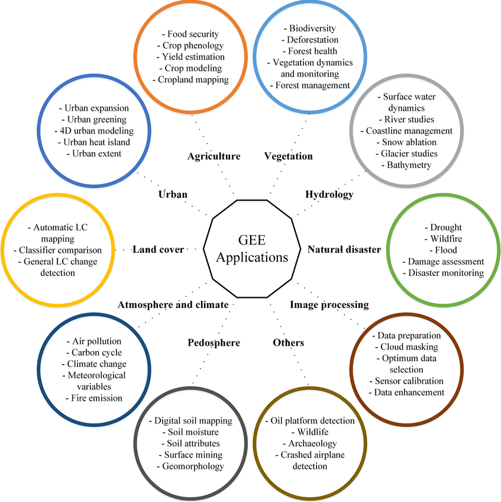
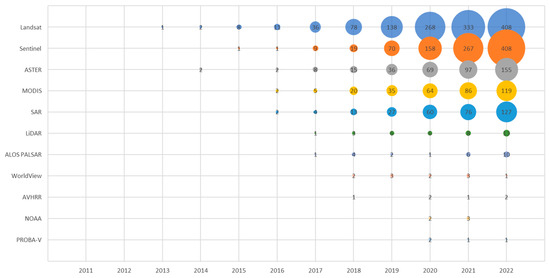

This section will look at using Google Earth Engine (GEE), a geospatial analysis platform where remotely sensing satellite imagery is stored. It allows easy access to high-performance computing resources to process and analyse very large data sets more efficiently. The following will be using Delhi, India as a study area for exploring GEE data processing methods.

## Summary

### Introduction to GEE

The below sums up the interactive interface on GEE platform, where all the coding for processing and analysis takes place. In GEE, it employs a client-server architecture. Earth engine objects can be easily identified as a "proxy object" with anything starting with `ee` on clients side, where the local environment interacts and communicates with the server.

::: {layout-ncol="1"}

:::

### Data Pre-processing 

#### Scale Factor

In GEE, images are pre-processed and cut into 256x256 pixel tiles for fast and efficient access and visualisation [@gorelick2017]. Scale refers to pixel resolution of images. Images are stored in multi-resolution levels in image pyramids, where it selects the spatial resolution that is closest to our chosen band scale (e.g. 30 meter pixel for Landsat).

Raw satellite pixel values are stored as integers to reduce storage size, therefore it needs to be converted to true values with the following math functions. The below lists math functions for most commonly used products:

+-----------------------------------------------+------------------------------------------------------------+
| Satellite                                     | Math Function                                              |
+===============================================+============================================================+
| Landsat 8 and 9 (Collection 2)                | Multiply by 0.0000275 and add -0.2 (Surface Reflectance)   |
|                                               |                                                            |
|                                               | Multiply by 0.00341802 and add 149.0 (Surface Temperature) |
+-----------------------------------------------+------------------------------------------------------------+
| Sentinel 2                                    | Multiply by 0.0001                                         |
+-----------------------------------------------+------------------------------------------------------------+
| MODIS (MOD13Q1 NDVI/EVI and MOD13A1 NDVI/EVI) | Multiply by 0.0001                                         |
+-----------------------------------------------+------------------------------------------------------------+

: Source: @usgs, @earthenginedatacatalouge

#### Filtering Image Collections

The reducing method ( `ee.Reducer` ) are commonly used to aggregate pixel values using mean, median, sum or percentiles.

To summarise pixel values within

-   `image.reduceRegion`, one region, suitable for NDVI, rainfall, etc.

-   `image.reduce.Regions`, multiple regions, suitable for land use cover

-   `image.reduce.Neighbourhood`, within the neighbourhood, suitable for terrain texture processing

Taking the median out of a stack of images is often the most common practice as it provides a simple and quite reliable summary of a time series data. However, its is also just a "good enough" approach and does not necessarily be the most suitable approach. In some cases, considering using percentiles maybe a more sensible approach than median. Selecting a higher percentile such as the 75th to 90th percentile range may better capture conditions and interpret more meaningful results.

::: {style="border: 1px solid #ddd; border-left: 4px solid #5cb85c; padding: 10px 15px; color: #5cb85c; border-radius: 4px; margin-bottom: 15px;"}
A good practice I will always adopt is to **apply the Scale Factor first**, **reducing image by region(s) or neighbourhood**, then take the **mean** (when there is a few images) **or median** (when there is a big stack of images) **depending on the volume of images obtained.**
:::

::: {layout-ncol="1"}

:::

### Benefits and Limitations

+-------------------------------+--------------------------------------------------------------------------------------------------------------------------------------------+----------------------------------------------------------------------------------------+
|                               | Benefits                                                                                                                                   | Limitations                                                                            |
+===============================+============================================================================================================================================+========================================================================================+
| Cloud-based Platform          | -   Free for non-commercial use                                                                                                            | -   Depend on internet access, cannot be used offline                                  |
|                               |                                                                                                                                            |                                                                                        |
|                               | -   Process remotely sensing data across large spatial and temporal scales                                                                 | -   Takes longer to download processed data                                            |
|                               |                                                                                                                                            |                                                                                        |
|                               | -   Fast filtering and sorting allows easier search in large image collections                                                             |                                                                                        |
|                               |                                                                                                                                            |                                                                                        |
|                               | -   Able to share scripts and workflows                                                                                                    |                                                                                        |
+-------------------------------+--------------------------------------------------------------------------------------------------------------------------------------------+----------------------------------------------------------------------------------------+
| Data and Data Pre-processing  | -   Large catalog of data sets (Landsat, Sentinel, MODIS, etc.)                                                                            | -   Analysis maybe limited to available tools within GEE                               |
|                               |                                                                                                                                            |                                                                                        |
|                               | -   Up-to-date data, with close to 6,000 new scenes daily from ongoing missions, and most imagery available within 24 hours of acquisition | -   SAR phase data are not supported, limiting Polarimetric SAR and InSAR applications |
|                               |                                                                                                                                            |                                                                                        |
|                               | -   Pre-processed data sets available                                                                                                      |                                                                                        |
|                               |                                                                                                                                            |                                                                                        |
|                               | -   Client side can upload, store and share data sets                                                                                      |                                                                                        |
|                               |                                                                                                                                            |                                                                                        |
|                               | -   Available derivative products (e.g. NDVI)                                                                                              |                                                                                        |
+-------------------------------+--------------------------------------------------------------------------------------------------------------------------------------------+----------------------------------------------------------------------------------------+
| Function and Analysis Methods | -   Support standard remote sensing and geospatial workflows                                                                               | -   Limited number of classification and regression algorithms available               |
|                               |                                                                                                                                            |                                                                                        |
|                               | -   Many available image processing functions: geometric operations, machine learning, classification, visualisation                       | -   Advanced deep learning models have to be conducted outside GEE                     |
|                               |                                                                                                                                            |                                                                                        |
|                               |                                                                                                                                            | -   Limited amount of samples / features within classification methods                 |
+-------------------------------+--------------------------------------------------------------------------------------------------------------------------------------------+----------------------------------------------------------------------------------------+

: Source: @amani2020, @gorelick2017, [CASA0023](https://andrewmaclachlan.github.io/CASA0023/)

## Applications

### Study Area: Delhi, India

To narrow down to the study area, a level 2 Shapefile from GAD4M and was clipped and filtered to Delhi using `.filter('GID_1 == "IND.25_1"');` within GEE. Data was filtered to the 2021-06-01 to 2022-10-10 date period.

#### Texture

Texture analysis is found that it can significantly increase classification accuracy (classification will be covered in next chapter), therefore best practices often combine texture and spectral analysis for obtaining the best results [@kupidura2019]. There are many methods for texture analysis methods, but this section, we will focus on using GLCM in GEE as discussed previously in [Correction](https://christychoicc.github.io/RSCE/correction.html#texture). The following highlighted high reflectance areas of urban land uses, industrial activities...

::: {layout-ncol="1"}

:::

#### PCA

GEE is also capable for conducting PCA analysis which was discussed earlier in [Correction](https://christychoicc.github.io/RSCE/correction.html#pca), but slightly more complex than doing it through R. Looking at the list of PCA values, the first 2 values answered around 93% of total variance of the study area. Therefore, combining these two bands, it is able to distinguish most land types within our study area.

```{r, echo=FALSE}
cat(readLines("gee/pca.txt"), sep = "\n")
```

::: {layout-ncol="1"}

:::

#### NDVI

As discussed previously in [Correction](https://christychoicc.github.io/RSCE/correction.html#normalised-difference-vegetation-index-ndvi), NDVI is used as an indicator for vegetation in studies. Also capable for calculating band maths, GEE allows NDVI analysis and even having its own function for easy calculation:

``` javascript
var NDVI = clip.normalizedDifference([SR_B5, SR_B4]);
```

::: {layout-ncol="1"}

:::

::: {layout-ncol="1"}

:::

Having exploring around, I also found that GEE supports plotting graphs of time series data, allowing an immediate understanding of an overall vegetation condition of our study area in this case. The above shows a time-series analysis of average NDVI in Delhi. Data gaps within the data series maybe due to data selection of \< 10% cloud cover. This figure captures seasonal differences of vegetation, offering insights of agricultural cycle and climate conditions in Delhi. The fluctuations of vegetation conditions peaked just before November before declining to around 0.35 to 0.4 during cooler seasons. There is an unusual sharp rise of NDVI values March, which maybe due to atmospheric noise of data rather than reflecting vegetation conditions? It continues to decline in May (hottest month of the year in Delhi) and thereafter.

GEE Code for this practical can be found [here](https://code.earthengine.google.com/cce3b32f442cce69c5831fa35a99f215).

### GEE Workflow

The above covered briefly on the general workflow on different types of operations through GEE. As shown in the figure below, GEE allows taking analysis from simple mathematical functions to more complex image processing and machine learning method, which more on machine learning will be discussed in later chapters.

::: {layout-ncol="1"}
{#reference alt="GEE Workflow"}
:::

### Applications of GEE in Research

GEE are used across an extensive wide discipline when it comes to research applications. The following sums up a range of applications that GEE supports as well as the satellite products that are most commonly used with GEE:

::: {layout-ncol="1"}

:::

::: {layout-ncol="1"}
[](https://www.mdpi.com/2072-4292/15/14/3675)
:::

## Reflection

Switching from manual data pre-processing in QGIS and SNAP to GEE has really been a massive upgrade in saving time and really easing off the computational complexity by a lot .

This week provided a good opportunity to delve in both JavaScript and GEE as a new language and new tool. I found exploring through Google Earth Engine webpage particularly insightful, offering ready-made code, concept explanations, and analysis guides that is easily accessible and user friendly for a first time user. I found it particularly useful that we can easily clip spatial boundary, not needed to worry about projections and that analysis outputs can be added as map layers, etc. The adjustable transparency in each layers was one of the things I liked most so far, as it allows comparison against Google's base map, observing the accuracy of data visually.

It has also raise my awareness for the limitations for non-commerical usage. GEE is implying a noncommercial quota tier from April 2026, capping free Earth Engine Compute Units (EECUs) on a monthly basis, which may possibly limit intensive workflows as a student user (especially for community tier). I also found the fact that GEE does not support markdown style cell-by-cell execution makes catching error harder for me. Although GEE's cloud computing capabilities makes it a very effective tool for remotely sensing analysis, but it also means that it is entirely dependent on stable internet connection, which may ocassionally be a problem.

I have touched upon Google Earth before in my undergraduate field trip in Porto, Portugal for site analysis purposes. It was really useful back then for identifying features within the site, understanding the surrounding context, and getting a brief understanding of the site upon arrival. Yet, Google Earth is more of a passive observational tool, and so building on that, this week's learning of GEE gave me flashbacks from my previous studies. Still using a Google served platform, but able to delve deeper in remotely sensing applications.

Overall, GEE provided more opportunities for advanced geospatial applications, I am excited to use GEE to do more cool analysis in the near future!
