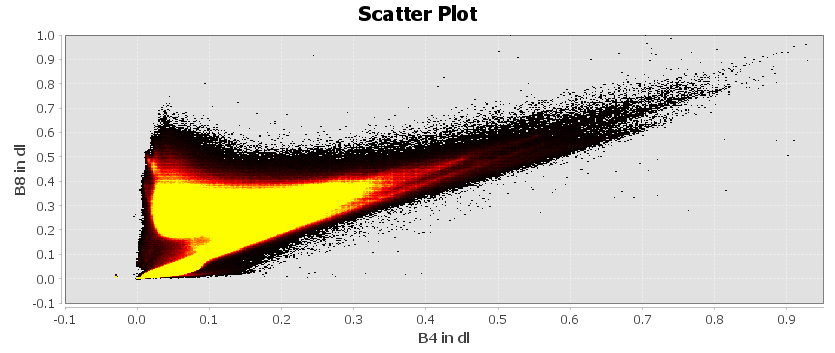
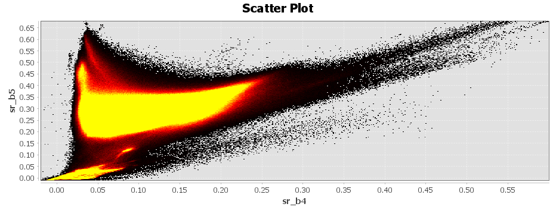

# Introduction

Remote sensing is not only satellite imagery but a system that allows us to obtain EO data through acquiring information from a distance using sensors on platforms. This section introduces types of sensors and resolutions of remote sensing data. The following study area of Lisboa, Portugal will demonstrate a workflow of analysing Earth Observations (EO) data processed through SNAP and R.

## Summary

### Types of Sensor

**Passive Sensors** detect energy emitted or reflected from the object by the sun. They mainly operate in the visible, infrared, thermal infrared, and microwave bands of the electromagnetic spectrum, mostly used to measure surface temperature, vegetation properties and other physical attributes. However, passive sensors cannot penetrate dense cloud cover, limiting areas with higher cloud rates.

**Active Sensors** emits energy and collect data based on changes in the return signal. Most active sensors have higher capabilities to penetrate atmospheric conditions. For example, the Synthetic Aperture Radar (SAR), has the ability to "see through cloud" as it operates with comparably longer wavelengths, allowing data collections during night hours. This allows them to be less dependent on sunlight which better handles atmospheric constraints.

Overall, observations are shaped by the electromagnetic spectrum and its interactions between radiation, atmosphere, and Earth’s surface, where radiation can be absorbed, transmitted, or scattered (Tempfli *et al.*, 2009). To mitigate atmospheric scattering in imagery, atmospheric correction can be applied to remove these effects.

::: {#Fig_Passive_Active_Sensors layout-ncol="2"}
)](images/w1_images/passive-instrument-illustration.png)

)](images/w1_images/active-instrument-illustration.png){#reference}
:::

### Types of Resolution

#### Spatial Resolution

The size of the raster grid cell per pixel, where it can range from metres to kilometres. The spatial resolution scale varies depending on specific observation and reasearch suitability, ranging from highest/finest resolution at 10m for buildings to the lowest/coarse at 100km for a global scale (NASA EARTHDATA).

#### Spectral Resolution

Visible part of the electromagnetic spectrum is composed of red, green and blue wavelengths. Multi-spectral sensors measure reflection at multiple wavelength bands to create spectral signatures, which such patterns of reflectence across the spectrum helps distinguish different surface features. However, observations are often constrained to atmospheric windows (e.g. cloud cover) which absorbs radiation.

::: {#CHUNKNAME layout-ncol="1"}
[)](images/w1_images/electromagnetic_spectrum.png){alt="Remote Sensing Resolutions (Source: NASA EARTHDATA)" fig-align="left"}](https://learn.arcgis.com/en/projects/explore-imagery-spectral-resolution/)
:::

#### Temporal Resolution

The frequency of a sensor's revisit in capturing the same observation area. The temporal resolution measurement period can vary from 1 to 16 days depending on the platform (NASA EARTHDATA <https://www.earthdata.nasa.gov/learn/earth-observation-data-basics/remote-sensing-resolution>).

#### Radiometric Resolution

The ability of a sensor to identify and discriminate between subtle differences in energy in each pixel.

::: {layout-ncol="1"}
)](images/w1_images/remote-sensing-resolutions.png)
:::

## Application

### Study Area: Lisboa, Portugal

Satellite imagery was obtained from Sentinel-2 and Landsat-9 and pre-processed with SNAP. Selecting the RGB-image it gives the **True Natural Color** combination of B4, B3 and B2. **False Colour Composite** of B8, B4 and B3 highlights healthy and unhealthy vegetation, with denser vegetation visualised as red and urban areas as white. **Atmospheric Penetration** of B12, B11 and B8A composites with no visible bands to penetrate atmospheric particles, highlighting vegetation in blue and urban areas as gray, cyan or purple. More can be found at [Sentinel 2 Bands and Combinations](https://gisgeography.com/sentinel-2-bands-combinations/).

::: {#Sentinel_Colour layout-ncol="3"}

:::

The scatter plots of Sentinel-2 (B4, B8) and Landsat (B4, B5) showed the spectral relationship between Red and Near-infrared spectral feature space. Both pixel distribution showed low values of NIR absorption for water , low red and high NIR values for vegetation and correlated red and NIR values increases for urban areas, characterizing the land cover composition of Lisboa.

::: {#Scatterplot layout-ncol="2"}

:::

#### Tasseled Caps

Different combinations of multi-spectral bands to examine relationship between the bands, to highlight physical land features. It is commonly used to evaluate **brightness**, **greenness** and **wetness** for monitor vegetation growth cycles, soil and urban development ( reference - <https://support.esri.com/en-us/gis-dictionary/tasseled-cap-transformation>).

Applied Maths Band Equations:

$$
\begin{split}Brightness=0.3037(B2) + 0.2793(B3)+\\0.4743(B4)+0.5585(B8)+\\0.5082(B11)+0.1863(B12)\end{split}
$$

$$
\begin{split}Greenness=-0.2848(B2)-0.2435(B3)\\-0.5436(B4)+0.7243(B8)+\\0.0840(B11)-0.1800(B12)\end{split}
$$

$$
\begin{split}Wetness=0.1509(B2)+0.1973(B3)\\+0.3279(B4)+0.3406(B8)\\-0.7112(B11)-0.4572(B12)\end{split}
$$

+-----------------------------+--------------------------------------------------------------------+
| Tasseled Cap Transformation | Physical Associations                                              |
+=============================+====================================================================+
| Brightness                  | -   Bare earth soil                                                |
|                             |                                                                    |
|                             | -   Built up surfaces                                              |
|                             |                                                                    |
|                             | -   Natural features (concrete, asphalt, gravel, rock outcrops...) |
|                             |                                                                    |
|                             | -   Bright materials                                               |
+-----------------------------+--------------------------------------------------------------------+
| Greenness                   | -   Green vegetation                                               |
+-----------------------------+--------------------------------------------------------------------+
| Wetness                     | -   Moisture                                                       |
|                             |                                                                    |
|                             | -   Soil moisture                                                  |
|                             |                                                                    |
|                             | -   Water                                                          |
+-----------------------------+--------------------------------------------------------------------+

: Tasseled Cap Functions (Source: [ArcGIS Pro](https://pro.arcgis.com/en/pro-app/latest/help/analysis/raster-functions/tasseled-cap-function.htm#ESRI_SECTION1_6B9B732A91344B8782F925E4BE4ACA4F))

The below two Sentinel-2 tasseled cap transformed imagery is adjusted for brightness, greenness and wetness between August and December 2025. Although there is no obvious land cover change, the comparisons have visualized some subtle hue changes within certain areas. Blue, red and pink areas of built up urban infrastructure (road networks, airport, coastal piers) and waters remained unchanged, while brown areas depicts the built up urban features. Greenness is distinguished by lighter blue and greens, highlighting areas with higher moisture and humibidity. Overall, vegetation coverage appears equivalent in both seasons

Despite Lisboa's Mediterranean climate, there is no fluctuation of seasonal vegetation coverage change. One interesting feature to look at is the Parque Florestal de Monsanto large urban forest, where the vegetation coverage has a very subtle brightness difference between August and December. With a high density of vegetation, the overlay of greenness and wetness detections also visualize moisture levels across time. Moving beyond the subtle variations in the visual interpretations, spectral reflectance across different bands will be looked at next.

::: {layout-ncol="2"}

:::

Spectral reflectance across bands showed distinct differences for each land cover type. Both sensors are found similar results for identifying the spectral behaviours between each land cover, while Landsat has a comparably higher mean reflectance across all bands. Both NIR bands are noted most significant for distinguishing vegetated and non-vegetated surfaces. Greenspace have been noted with the lowest reflectance, while bare earth has the highest reflectance.

::: {layout-ncol="1"}

:::

Sentinel-2 and Landsat have very similar spectral bands, where key differences are their spatial and temporal resolution. Sentinel-2 has a comparably finer spatial resolution and higher revisit frequency, giving advantages of higher details and regular monitoring of dynamic changes. Despite, their spectral similarity allows cross-validation analysis when there are limitations of cloud coverage or data availability on one platform, enabling higher flexibility multi-temporal studies.

::: {layout-ncol="1"}
)](images/w1_images/dmidS2LS7Comparison.png)
:::

## Reflection

Beyond capturing Earth's surface imagery, EO data functions as a powerful measurement tool. This has shifted my perspective from viewing satellite imagery primarily as visual reference material to recognizing it as a quantitative measurement instrument. Interpretation varies significantly depending on band selection, resampling methods, and processing techniques. EO has demonstrated potential for efficiently mapping vast areas for monitoring and early prediction, but this requires careful consideration of cloud coverage, noise, and systematic biases. Lisboa has been a strong study area, as it display features of coastal conditions where atmospheric effects influence satellite reflectance and interpretation. The analysis demonstrated the strength of multispectral signatures, where urban and greenspace land uses can be distinguished through spectral characteristics. Therefore, further understanding atmospheric correction and scattering effects is essential, as cloud coverage and particles redirect radiation, which weakens surface sensing and reducing data quality.

## References

Sentinel Data Source:

<https://identity.dataspace.copernicus.eu/auth/realms/CDSE/protocol/openid-connect/auth?client_id=sh-5f8b630b-b083-49ed-b340-b8f01ecb81c4&redirect_uri=https%3A%2F%2Fbrowser.dataspace.copernicus.eu%2F%3Fzoom%3D5%26lat%3D50.16282%26lng%3D20.78613%26demSource3D%3D%2522MAPZEN%2522%26cloudCoverage%3D30%26dateMode%3DSINGLE&state=26c991f3-8c5e-487e-b23d-d5fe36fbabb7&response_mode=fragment&response_type=code&scope=openid&nonce=c67a4727-3008-4473-8b84-0a9304c87ce3&code_challenge=ZGmOypxnXCivN18EjxS722lF4SDVSsskdcUb_zktYp4&code_challenge_method=S256>
