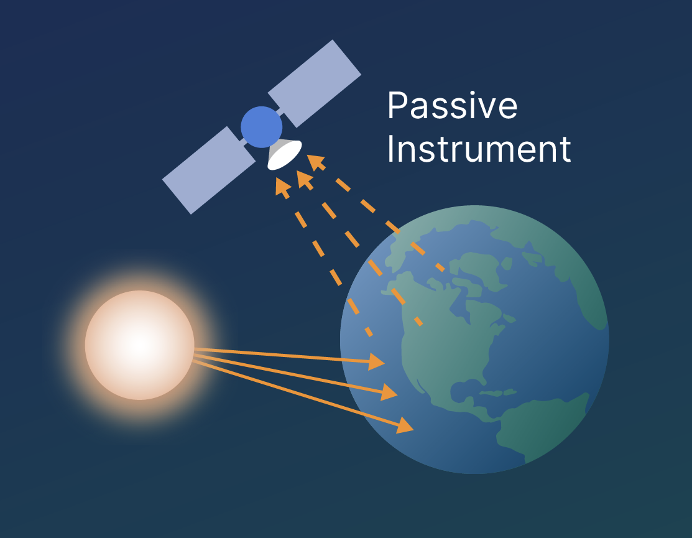

# Introduction

Remote sensing is not only satellite imagery but a system that allows us to obtain EO data through acquiring information from a distance using sensors on platforms. This section introduces types of sensors and resolutions of remote sensing data. The following study area of Lisbon will demonstrate a workflow of analysing Earth Observations (EO) data processed through QGIS and SNAP.

## 1.1. Summary 

### 1.1.1. Types of Sensor

**Passive Sensors** detect energy emitted or reflected from the object by the sun. They mainly operate in the visible, infrared, thermal infrared, and microwave bands of the electromagnetic spectrum, mostly used to measure surface temperature, vegetation properties and other physical attributes. However, passive sensors cannot penetrate dense cloud cover, limiting areas with higher cloud rates.

**Active Sensors** emits energy and collect data based on changes in the return signal. Most active sensors have higher capabilities to penetrate atmospheric conditions. For example, the Synthetic Aperture Radar (SAR), has the ability to "see through cloud" as it operates with comparably longer wavelengths, allowing data collections during night hours. This allows them to be less dependent on sunlight which better handles atmospheric constraints.

Overall, observations are shaped by the electromagnetic spectrum and its interactions between radiation, atmosphere, and Earth’s surface, where raditaion can be absorbed, transmitted, or scattered (Tempfli *et al.*, 2009).

::: {#Fig_Passive_Active_Sensors layout-ncol="2"}

{#reference}
:::
