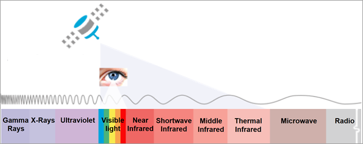
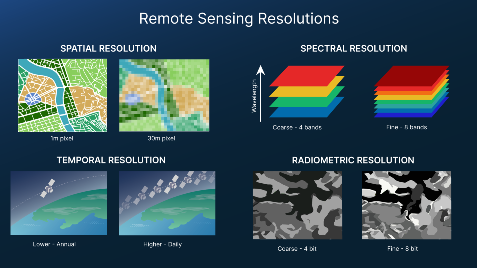
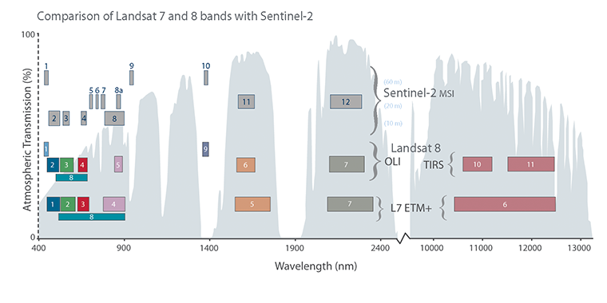

# Introduction

Remote sensing is not only satellite imagery but a system that allows us to obtain EO data through acquiring information from a distance using sensors on platforms. This section introduces types of sensors and resolutions of remote sensing data. The following study area of Lisbon, Portugal will demonstrate a workflow of analysing Earth Observations (EO) data processed through SNAP and R.

## Summary

### Types of Sensor

**Passive Sensors** detect energy emitted or reflected from the object by the sun. They mainly operate in the visible, infrared, thermal infrared, and microwave bands of the electromagnetic spectrum, mostly used to measure surface temperature, vegetation properties and other physical attributes. However, passive sensors cannot penetrate dense cloud cover, limiting areas with higher cloud rates.

**Active Sensors** emits energy and collect data based on changes in the return signal. Most active sensors have higher capabilities to penetrate atmospheric conditions. For example, the Synthetic Aperture Radar (SAR), has the ability to "see through cloud" as it operates with comparably longer wavelengths, allowing data collections during night hours. This allows them to be less dependent on sunlight which better handles atmospheric constraints.

Overall, observations are shaped by the electromagnetic spectrum and its interactions between radiation, atmosphere, and Earth’s surface, where radiation can be absorbed, transmitted, or scattered [@tempfli2009]. To mitigate atmospheric scattering in imagery, atmospheric correction can be applied to remove these effects.

::: {#Fig_Passive_Active_Sensors layout-ncol="2"}

{#reference}
:::

### Types of Resolution

#### Spatial Resolution

The size of the raster grid cell per pixel, where it can range from metres to kilometres. Finer spatial resolution is useful when analysing detailed urban features such as buildings as smaller pixels preserve more local variation. Coarser spatial resolution, however, can still be appropriate for regional or global analysis where broad patterns matters more than fine detail. Therefore “higher resolution” is not always better, it is depends on specific observation and research suitability.

#### Spectral Resolution

Different materials reflect and absorb energy differently across wavelengths, creating the spectral signatures that allow vegetation, water, bare soil and built surfaces to be distinguished. Multi-spectral sensors measure reflection at multiple wavelength bands to create spectral signatures. However, observations are often constrained to atmospheric windows (e.g. cloud cover) which absorbs radiation. In practice, such reflectance patterns across the spectrum determines how remote sensing observe, distinguish land usage and identify and understand conditions.

::: {#CHUNKNAME layout-ncol="1"}
[{alt="Remote Sensing Resolutions (Source: NASA EARTHDATA)" fig-align="left"}](https://learn.arcgis.com/en/projects/explore-imagery-spectral-resolution/)
:::

#### Temporal Resolution

The frequency of a sensor's revisit in capturing the same observation area. The temporal resolution measurement period can vary from 1 to 16 days depending on the platform [@earthsciencedatasystems2025]. Particularly useful in environmental monitoring where measurements are time sensitive.

#### Radiometric Resolution

The ability of a sensor to identify and discriminate between subtle differences in energy in each pixel.

::: {layout-ncol="1"}

:::

## Application

**Study Area: Lisbon, Portugal**

Satellite imagery obtained from Sentinel-2 and Landsat-9 were pre-processed with SNAP to explore how different band combinations change the visibility of land-cover patterns. **True natural colour** (B4, B3, B2) provides an image of RGB, while **false colour composite** (B8, B4, B3) highlights healthy and unhealthy vegetation and its density levels using near-infrared reflectance. **Atmospheric penetration** is also useful as it reduce reliance on visible wavelengths which made it easier to distinguish surfaces under more complex atmospheric conditions. More of Sentinel 2 Bands and Combinations can be found at @gisgeogra

::: {#Sentinel_Colour layout-ncol="3"}

:::

The scatter plots of Lisbon under Sentinel-2 (B4, B8) and Landsat (B4, B5) showed the spectral relationship between Red and Near-infrared spectral feature space. Both pixel distribution showed low values of NIR absorption for water, low red and high NIR values for vegetation and correlated red and NIR values increases for urban areas, characterising Lisbon's land cover composition .

::: {#Scatterplot layout-ncol="2"}

:::

### Tasseled Caps

Different combinations of multi-spectral bands to examine relationship between the bands, to highlight physical land features. It is commonly used to evaluate **brightness**, **greenness** and **wetness** for monitor vegetation growth cycles, soil and urban development [@esri].

Applied Maths Band Equations:

$$
\begin{split}Brightness=0.3037(B2) + 0.2793(B3)+\\0.4743(B4)+0.5585(B8)+\\0.5082(B11)+0.1863(B12)\end{split}
$$

$$
\begin{split}Greenness=-0.2848(B2)-0.2435(B3)\\-0.5436(B4)+0.7243(B8)+\\0.0840(B11)-0.1800(B12)\end{split}
$$

$$
\begin{split}Wetness=0.1509(B2)+0.1973(B3)\\+0.3279(B4)+0.3406(B8)\\-0.7112(B11)-0.4572(B12)\end{split}
$$

+-----------------------------+----------------------------------------------------------------+
| Tasseled Cap Transformation | Physical Associations                                          |
+=============================+================================================================+
| Brightness                  | Bare earth soil                                                |
|                             |                                                                |
|                             | Built up surfaces                                              |
|                             |                                                                |
|                             | Natural features (concrete, asphalt, gravel, rock outcrops...) |
|                             |                                                                |
|                             | Bright materials                                               |
+-----------------------------+----------------------------------------------------------------+
| Greenness                   | Green vegetation                                               |
+-----------------------------+----------------------------------------------------------------+
| Wetness                     | Moisture                                                       |
|                             |                                                                |
|                             | Soil moisture                                                  |
|                             |                                                                |
|                             | Water                                                          |
+-----------------------------+----------------------------------------------------------------+

: Tasseled Cap Functions, Source: @arcgispro

The below two Sentinel-2 tasseled cap transformed imagery is adjusted for brightness, greenness and wetness between August and December 2025. The Parque Florestal de Monsanto (urban forest) is still clearly visible in both, and the roads, built up areas do not seem to change much between the two seasons. Variations in brightness, greenness or wetness are quite subtle and difficult to identify by comparing the images. Given that, the comparison shows limitations of qualitative interpretation. The tasseled cap transformation does help transform spectral information for easier interpretation, but when two images look similar, vegetation or moisture change may require further quantitative support (maybe calculating difference between seasons?). Moving beyond visual interpretations, spectral reflectance across different bands will be looked at next.

::: {layout-ncol="2"}

:::

Spectral reflectance across bands showed distinct differences for each land cover type. Both sensors are found similar results for identifying the spectral behaviours between each land cover, while Landsat has a comparably higher mean reflectance across all bands. Both NIR bands are noted most significant for distinguishing vegetated and non-vegetated surfaces. Greenspace have been noted with the lowest reflectance, while bare earth has the highest reflectance.

::: {layout-ncol="1"}

:::

Both have very similar spectral bands, where key differences are their spatial and temporal resolution. Sentinel-2 has a comparably finer spatial resolution and higher revisit frequency than Landsat, giving advantages of higher details and regular monitoring of dynamic changes. Despite, their spectral similarity allows cross-validation analysis when there are limitations of cloud coverage or data availability on one platform, enabling higher flexibility multi-temporal studies.

::: {layout-ncol="1"}

:::

## Reflection

Beyond capturing Earth's surface imagery, this week's learning has showed me that EO data can be a powerful measurement tool. I've always been aware of satellite imagery accessed through tools like Google Maps, but never understood the underlying mechanics of how it actually works. And so, this week genuinely shifted my perspective of satellite imagery as data. Hearing the term "electromagnetic spectrum" takes me back to a song my GCSE Physics teacher used to show us, which was stuck in my head for a week:



Lisbon has been a interesting study area, it displays features of both an urban forest and coastal conditions, where atmospheric effects influence satellite reflectance and interpretation. At the same time, this also showed me the limitations of EO, especially data quality which shape what can be extracted from the data. This is important under policy context, where EO-based evidence should not be treated as perfectly objective or policy-ready as reliability depends on data quality, timing, correction and validation.

While EO data showed potential for large-scale environmental monitoring and prediction purposes, interpretation varies significantly depending on band selection, resampling methods, and processing techniques, which may require careful considerations of cloud coverage, noise, and systematic biases. As demonstrated through the analysis of urban and green space land uses above, multispectral analysis can be a very helpful tool for planning policy practices. However, it does poses limitations of data quality. Therefore, further understanding atmospheric correction and scattering effects is essential, as cloud coverage and particles redirect radiation, which weakens surface sensing and reducing data quality.
