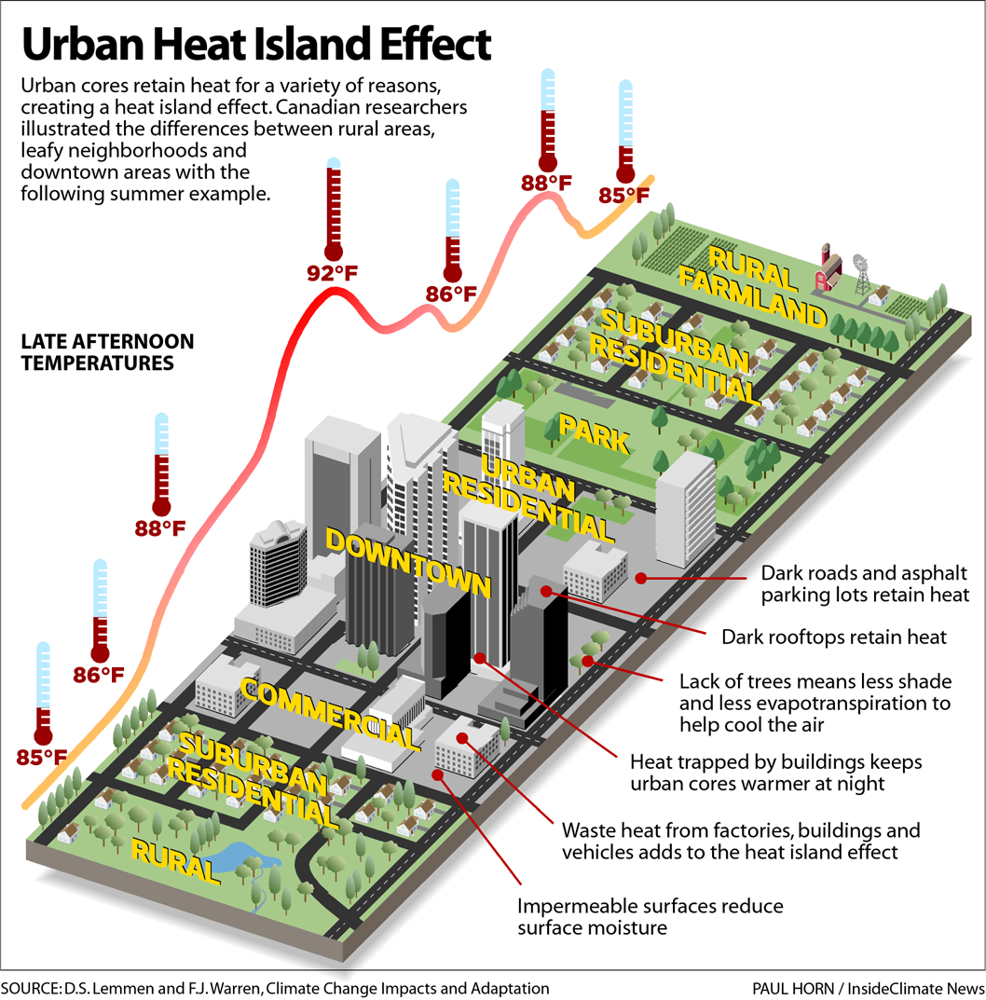
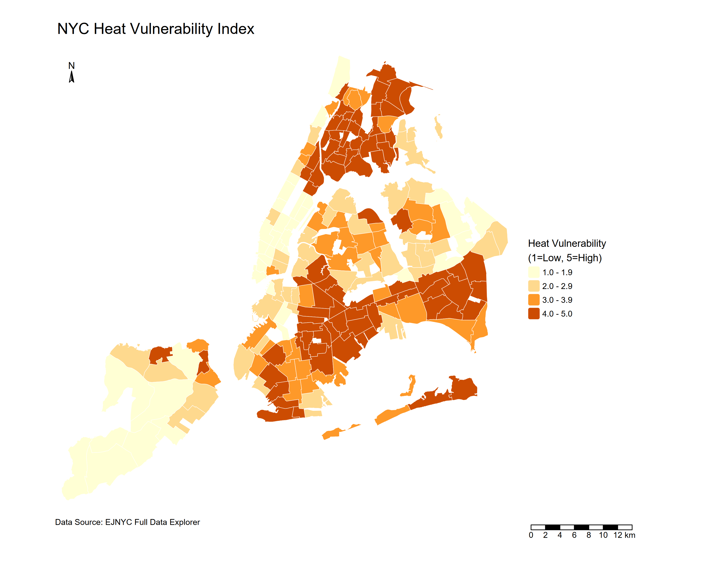

This section will look at New York City, USA as a case study city, with their the OneNYC 2050 strategy's goal to achieve "A Liveable Climate" [@nyc.gov2019]. Like most dense urban areas, New York City (NYC) is also facing the problems of warmer urban temperatures than its rural and suburban neighborhoods. Given growing events of higher frequency, longer lasting and more intense heat waves, this section will focus on one of NYC's experiencing climate threats of extreme heat [@nyc.gov].

## Summary

The OneNYC 2050: Building a Strong and Fair City is a long term strategic plan compromised of 8 goals and 30 initiatives. It frames its climate resilience goal under "A Livable Climate" recognising extreme heat as one of its major climate threats. Initiative 21 is especially relevant because it focuses on strengthening communities, buildings and infrastructure against climate risks, including extreme heat.

+------------------------------------------------------------------------------------------------------------------+
| A Livable Climate Obejectives, OneNYC 2050                                                                       |
+==================================================================================================================+
| 20. Achieve carbon neutrality and 100 percent clean electricity                                                  |
| 21. A LIVABLE CLIMATE Strengthen communities, buildings, infrastructure, and the waterfront to be more resilient |
| 22. Create economic opportunities for all New Yorkers through climate action                                     |
| 23. Fight for climate accountability and justice                                                                 |
+------------------------------------------------------------------------------------------------------------------+

: Relevant Initiatives, Source: @nyc.gov2019

OneNYC has stated extreme heat to be one of its "number one cause of mortality from weather conditions" [@nyc.gov2019, p.32]. Also known as the Urban Heat Island (UHI) effect, is a challenge that is widely faced by many cities globally. These neighborhoods tends to have concentrations dark surfaces from built structures, concrete and asphalt that absorbs and retain solar radiation throughout the day, while having limited green space to facilitate natural cooling through evapotranspiration and solar shading. The NYC has also identified limited access to air conditioning, energy costs and poor housing quality as drivers of such heat impacts [@nyc.gov].

::: {layout-ncol="1"}

:::

"All heat deaths are preventable" [@nyc.gov2019]. The OneNYC uses a Heat Vulnerability Index to identify neighborhoods that are more at risk following extreme heat. This showed heat as an urban problem to heat with unevenly distributed risk, concentrated in South Bronx, Central Brooklyn and Upper Manhattan in NYC. Therefore, policy should not only measure where surfaces are hottest, but also where people/ neighbourhoods are most exposed and vulnerable.

::: {layout-ncol="1"}

:::

In action, the OneNYC strategy supports scientific based decision-making, and is commited to ensure that policies and physical actions are protective and cost effective. It is commited to intervene through a range of nature-based and built solutions, such as promoting urban forests efforts to combat extreme heat, installation of cool roofs to lower local temperatures and mitigate the health impacts from UHI as well as further green infrastructure investments.

## Application

### Data

Land surface temperature (LST) derived from sensors are particularly useful for identifying the spatial pattern of surface heat across neighborhoods and for monitoring how interventions change surface temperatures over time. The following are commonly used for measuring urban heat:

-   Landsat 8-9 Collection 2 Level 2 Operational Land Imager (OLI), Thematic Mapper (TM), Enhanced Thematic Mapper (ETM+), Thermal Infrared Sensor (TIRS)

    ::: {style="border: 1px solid #ddd; border-left: 4px solid #5cb85c; padding: 10px 15px; color: #5cb85c; border-radius: 4px; margin-bottom: 15px;"}
    High spatial resolution; Consistent data for long-term monitoring
    :::

    ::: {style="border: 1px solid #ddd; border-left: 4px solid #d9534f; padding: 10px 15px; color: #d9534f; border-radius: 4px; margin-bottom: 15px;"}
    Low temporal resolution; Unable to penetrate through clouds
    :::

-   Terra and/or Aqua, MODIS

    ::: {style="border: 1px solid #ddd; border-left: 4px solid #5cb85c; padding: 10px 15px; color: #5cb85c; border-radius: 4px; margin-bottom: 15px;"}
    High temporal resolution (1-2 days)
    :::

    ::: {style="border: 1px solid #ddd; border-left: 4px solid #d9534f; padding: 10px 15px; color: #d9534f; border-radius: 4px; margin-bottom: 15px;"}
    Coarse spatial resolution may not be suitable for heterogeneous (mixed-used) urban environments; Unable to penetrate through clouds
    :::

-   ECOSTRESS

    ::: {style="border: 1px solid #ddd; border-left: 4px solid #5cb85c; padding: 10px 15px; color: #5cb85c; border-radius: 4px; margin-bottom: 15px;"}
    LST observations can be made continuously and during day and night; Can identify areas of at-risk 'hot spots'; Atmospheric Corrected
    :::

    ::: {style="border: 1px solid #ddd; border-left: 4px solid #d9534f; padding: 10px 15px; color: #d9534f; border-radius: 4px; margin-bottom: 15px;"}
    Unable to penetrate through clouds
    :::

-   SOLWEIG

    Requires elevation models, land cover data, and meteorological data (air temperature, relative humidity, barometric pressure, wind speed, wind direction, and downward shortwave radiation)

    ::: {style="border: 1px solid #ddd; border-left: 4px solid #5cb85c; padding: 10px 15px; color: #5cb85c; border-radius: 4px; margin-bottom: 15px;"}
    Temperature can be modeled per square meter every 3 hours and outputs can be compared to low and high density urban areas
    :::

    ::: {style="border: 1px solid #ddd; border-left: 4px solid #d9534f; padding: 10px 15px; color: #d9534f; border-radius: 4px; margin-bottom: 15px;"}
    Meterological data are often unavailable in spatially continuous form (raster data)
    :::

    Source: @thome2026 , @zhou2019, @solecki2015, @hantson2013, @maclachlan2021

One key takeaway is that no dataset is “best. The right choice depends on the research aims. For hotspot mapping and intervention targeting, Landsat is more suitable. For continuous monitoring, MODIS or ECOSTRESS are more appropriate. For human thermal comfort, modelled approaches such as SOLWEIG may be most policy relevant.

### Addressing Policy Challenge

This hits a common limitation of metropolitan policy documents, which tend to set strategic direction but lack local level specifities towards heat reduction targets [@maclachlan2021]. OneNYC incoporates UHI into strategies, the following key UHI related objectives from initiative 21 can be potentially be addressed through remotely sensing evidences:

| Objectives | Application | Methodology | Remotely Sensing Data |
|----|----|----|----|
| Advance nature-based solutions to mitigate physical risks posed by climate change (OneNYC 2050: Thriving Neighbourhoods -Urban Forests) | Identify seasonal UHI trends to inform strategic planning and target areas that would benefit most from enhanced greenery systems (e.g. areas with high LST but low vegetation) | Calculate LST from TIRS spectral bands 10 and 11 using NDVI, Land Surface Emissivity (LSE) and Brightness Temperature (BT) | Landsat 8-9 |
| Promote climate health preparedness for heat-vulnerable New Yorkers (OneNYC 2050: A Livable Climate - Cool Roofs Programme) | Understand and monitor spatialtemporal performances and trends of reflective coated cool roofs, to target areas (e.g. high roof concentrations but poor thermal performance) for implementation | Identify hotspots using LST and compare LST trends before and after implementation | Landsat 8-9 |
| Study emerging climate impacts to better understand NYC's built environment and communities (OneNYC 2050: A Liveable Climate - Heat Vulnerability Index) | Identify locations of heat vulnerability (e.g. Heat Vulnerability Index; Surface Heat Assessment) | LST / LST prediction assessed through Universal Thermal Comfort Index (UTCI) | LiDAR; ECOSSTRESS; Landsat 8-9 |
| Continue to refine the climate resiliency design guidelines | Not Applicable via Remote Sensing | \- | \- |

: Sources: @ahmad2025, @mushore2023 , @bonanni2025 , @nyc.gov2022 , @nycopendata

### Limitations and Integrated Approaches

Satellite thermal infrared data measures physical surface heat, not the street level air temperature humans actually experience, so it may overlook areas where extreme heat can cause deaths [@shandas2019]. Integrating satellite data with ground-based measurements that is fairly distributed across the city can strengthen monitoring and improves accuracy, especially in neighborhoods with higher heat vulnerability [@solecki2015; @mushore2023].

## Reflection

This section deepened my understanding of policy and remotely sensing data's role in addressing urban climate challenges. Remotely sensing data provides spatial evidence that bridges between policy objectives and decision-makings. This allowed translation of visionary strategies into actionable solutions.

Metropolitan policies tends to provide an overall vision for actions, governance and long-term goals, rather than technical implementation details. The OneNYC identified extreme heat as a priority threat and named vulnerable neighborhoods, but did not specify how spatial evidence should be used to guide action.

Many studies relied on satellite-based thermal infrared (TIR) data. A key insight is that it could be a limitation, as it captures purely surface temperature but not the temperature that humans experience at street level. This matters in dense neighborhoods where the urban form shapes heat exposure and health risk. Ground-based measurements enables observations of variation of temperature across different land uses and land covers, providing a more throughout assessment of urban heat across the city. Critically, this method is more expensive and resource intensive for a large installation coverage.

What remains uncertain is whether the political and institutional conditions exist to translate spatial evidence into action. [@mushore2023] note that urban greening strategies need to scaled up at municipal scale to be economically viable, which requires coordination across all boroughs and political support. OneNYC 2050 aligns with the UNEP Beat the Heat Handbook and to SDGs 3, 11 and 13, but alignment with global frameworks does not mean local implementations Ultimately, success depends on long term stakeholder collaboration and the technical and economic capacity to turn spatial evidence into equitable, actionable solutions.
