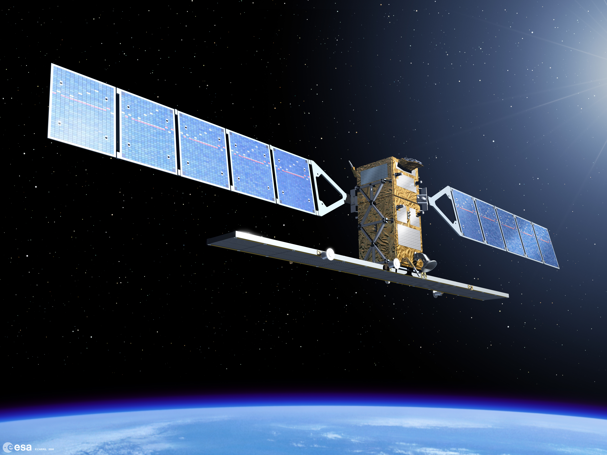

```{r setup, include=FALSE}
library(RefManageR)
BibOptions(check.entries = FALSE,
           bib.style = "authoryear",
           cite.style = "authoryear",
           style = "markdown",
           hyperlink = TRUE,
           dashed = FALSE,
           no.print.fields=c("doi", "url", "urldate", "issn"))
myBib <- ReadBib("../references.bib", check = FALSE)
```

```{r xaringan-themer, include=FALSE, warning=FALSE}
library(xaringanthemer)

style_mono_light(
  base_color = "#2c3e50",
  background_color = "#fafafa",
  header_font_google = google_font("Libre Baskerville"),
  text_font_google   = google_font("Libre Baskerville"),
  code_font_google   = google_font("Fira Code"),
  base_font_size = "16px",
  header_h1_font_size = "2.2rem", # Was likely ~2.5-3rem by default
  header_h2_font_size = "1.8rem",
  header_h3_font_size = "1.4rem",
  extra_css = list(
    # Title (h1)
    ".title-slide h1" = list(
      "font-size" = "40px",
      "margin-bottom" = "15px"
    ),
    # Subtitle (h2)
    ".title-slide h2" = list(
      "font-size" = "28px",
      "margin-top" = "0px",
      "margin-bottom" = "30px"
    ),
    # Author, Institute, Date (h3)
    ".title-slide h3" = list(
      "font-size" = "18px",
      "font-weight" = "normal",
      "margin-bottom" = "10px"
    )
  )
)
```

# What is Sentinel-1? 
.pull-left[
* A polar orbiting two satellite constellation that carries C-band synthetic aperture radar (C-SAR)

* Able to acquire data under day-and-night, all weather and atmospheric conditions

* Able to capture land, ice, and coastal zones data with high and medium resolutions

* Launched by the European Space Agency (ESA) under the Copernicus Program to acquire environment and security data
]

.pull-right[
```{r, echo=FALSE, out.width='100%', fig.align='right'}
# Add a sentinel-1 picture
# Source: https://sentiwiki.copernicus.eu/web/sentinel-1

```
<p style="font-size: 0.6em; text-align: center; margin-top: 0;">
Figure 1: Sentinel-1 (Source: <a href="https://sentiwiki.copernicus.eu/web/sentinel-1">SentiWiki Copernicus</a>)
</p>
]

---

# Mission of Sentinel-1C
```{r tech-setup, include=FALSE}
# Panel settings

options(htmltools.dir.version = FALSE)
# Load xaringanExtra for the tabs
xaringanExtra::use_panelset()
style_extra_css(css = list(
  ".pull-left-3" = list("float" = "left", "width" = "32%"),
  ".pull-middle-3" = list("float" = "left", "width" = "32%", "margin-left" = "2%", "margin-right" = "2%"),
  ".pull-right-3" = list("float" = "right", "width" = "32%"),
  ".pull-left-4" = list("float" = "left", "width" = "22%"),
  ".pull-mid1-4" = list("float" = "left", "width" = "22%", "margin-left" = "4%"),
  ".pull-mid2-4" = list("float" = "left", "width" = "22%", "margin-left" = "4%"),
  ".pull-right-4" = list("float" = "right", "width" = "22%")
))
```

Launched in 5 December 2024, reestablished a two-satellite constellation orbiting 180° apart for extensive worldwide coverage by May 2025, with improved features such as the Automatic Identification System (AIS) for maritime tracking.

### Key Mission Objectives and Applications
.panelset[
.panel[.panel-name[Land Monitoring]
<div style="font-size: 14px;">
.pull-left-3[
#### Forestry
* **Role**: Forest Type Classification, Biomass Estimation, Disturbance Detection

* **Climate Change**: Forest Carbon History, Estimate Carbon Emissions

* **Land Cover**: Support forest management, Monitor illegal timber harvesting activities
]

.pull-middle-3[
#### Agriculture
* **Role**: Food Security, Monitor Crop Conditions

* **Agricultural Production**: Harvest Prediction, Monitor Seasonal Changes, Pastures Productivity, Drought Impacts

* **Soil**: Monitor Soil Properties, Soil Degradation, Land Productivity, Tillage Activities

* **Policy**: Supporting Sustainable Development and using estimations to support Food Security efforts
]

.pull-right-3[
#### Urban Deformation Mapping
* **Role**: Accurate Monitoring of Surface Deformation

* **Land Subsidence**: Detect surface movements to up an accuracy of few millimetres per year

* **Infrastructure**: Detect Structural Damage to Infrastructures (e.g. Buildings) and Underground Conditions

* **Disaster**: Assess Damage/ Devastation After Events (e.g. Explosion)
]
<div style="clear:both"></div>

</div>
]

.panel[.panel-name[Maritime Monitoring]
<div style="font-size: 14px;">
.pull-left-4[]

.pull-mid1-4[]

.pull-mid2-4[]

.pull-right-4[]

<div style="clear:both"></div>

</div>
]

.panel[.panel-name[Emergency Management]
<div style="font-size: 14px;">
.pull-left-3[
#### Flood Monitoring
* **Role**: Impact Assessment on human, economic and environmental loss

* **Extensive Mapping**: Assessing flooded areas with cloud cover, High Frequency of Revisits

* **Hydrology**: Digital Elevation Models (DEM) for Run-off and Inundation Analysis 

* **Vegetation**: Detect Flooded Vegetation

]

.pull-middle-3[
#### Earthquake Analysis
* **Role**: Persistent Monitoring of Earthquake-Prone Areas

* **Earthquake Deformation Mapping** 

* **Identify Potential Risks**: Discover Active Fault Lines from Persistent Monitoring

* **Large-scale Monitoring**: Interferometric Wide swath mode allows easier monitoring of large scale earthquakes

]

.pull-right-3[
#### Landslide and Volcano Monitoring
* **Role**: Identify Areas Prone to Landslides, Monitor Surface Deformation

* **Identify Potential Warnings**: First Signs of Increasing Levels of Volcanic Activity, Preceding Earthquakes, Pre-eruption Uplift, Quantify Ground Deformation, Post Eruption Volcanic Shrinkage

]
<div style="clear:both"></div>

</div>
]
]

* Reference Sources: [NASA EARTHDATA](https://www.earthdata.nasa.gov/data/platforms/space-based-platforms/sentinel-1) , [SentiWiki Copernicus](https://sentiwiki.copernicus.eu/web/s1-applications#S1Applications-OverviewofS1Applications)
---

# Technical Specifications
.pull-left[
.panelset[
.panel[.panel-name[Resolution]
* Spatial Coverage: Worldwide

* Spatial Resolution: 25 x 40 m, 5 x 5 m, and 5 x 20 m

* Spectral Resolution: C-band radar at 5.405 GHz

* Temporal Coverage: 
  * Global revisit bi-weekly (interval of 12 Days)
  * Repeat frequency of 6 days with two-satellites constellation
  * 175 orbits per cycle per satellite
  * Revisit rates higher in areas with higher latitude (e.g. < 1 day at Arctic, ~ 2 days at Europe)
  
* Reference Sources: [SentiWiki](https://sentiwiki.copernicus.eu/web/sentiwiki) , [NASA EARTHDATA](https://www.earthdata.nasa.gov/data/instruments/sentinel-1-c-sar#:~:text=Instrument%20Type,Frequently%20Asked%20Questions) , [Torres. et.al, 2012](https://www.sciencedirect.com/science/article/pii/S0034425712000600) 
]
.panel[.panel-name[Specifications]

* Orbital Altitude: 693 km

* Sensor Complement: C-SAR (C-band Synthetic Aperture Radar)

* Operative autonomy: 96 hours

* Lifespan: 7.25 years (consumables for 12 years)

* Reference Sources: [eoPortal](https://www.eoportal.org/satellite-missions/copernicus-sentinel-1#spacecraft)

] ] ] .pull-right[
```{r, echo=FALSE, out.width='280px', fig.align='center'}
# Add a sentinel-1 constellation 
# Source: https://sentiwiki.copernicus.eu/web/s1-mission
knitr::include_graphics("../images/w2_images/sentinel1_constellation.png")
```
<p style="font-size: 0.6em; text-align: center; margin-top: -10px; margin-bottom: 20px;">
Figure 2: Sentinel-1 Constellation (Source: <a href="https://sentiwiki.copernicus.eu/web/s1-mission">SentiWiki Copernicus</a>)
</p>

```{r, echo=FALSE, out.width='280px', fig.align='center'}
# Add a ground range detection picture 
# Source: https://www.earthdata.nasa.gov/data/platforms/space-based-platforms/sentinel-1
knitr::include_graphics("../images/w2_images/GoundRangeDetected-Cumulative-2026-01.png")
```
<p style="font-size: 0.6em; text-align: center; margin-top: -10px;">
Figure 3: Sentinel-1 Ground Range Detected Coverage (Source: <a href="https://www.earthdata.nasa.gov/data/platforms/space-based-platforms/sentinel-1">NASA Earthdata</a>)
</p>
]

---

# Benefits and Limitations 

---

# Application: Land Monitoring

---

# Application: Maritime Monitoring

---

# Application: Emergency Response Management

---

# Reflection

