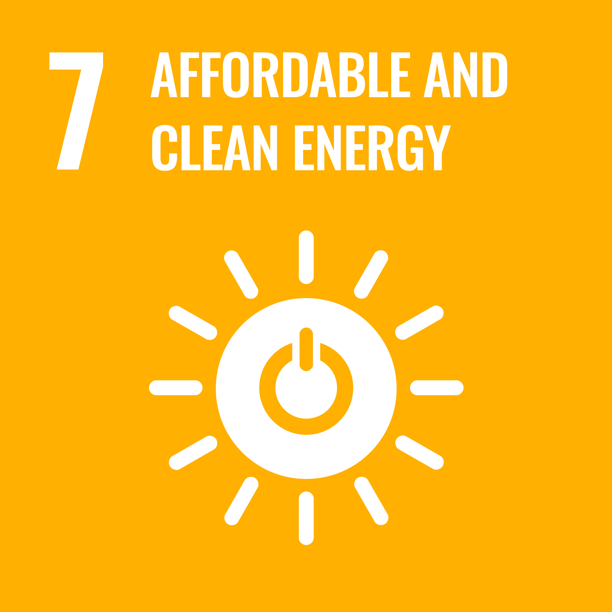
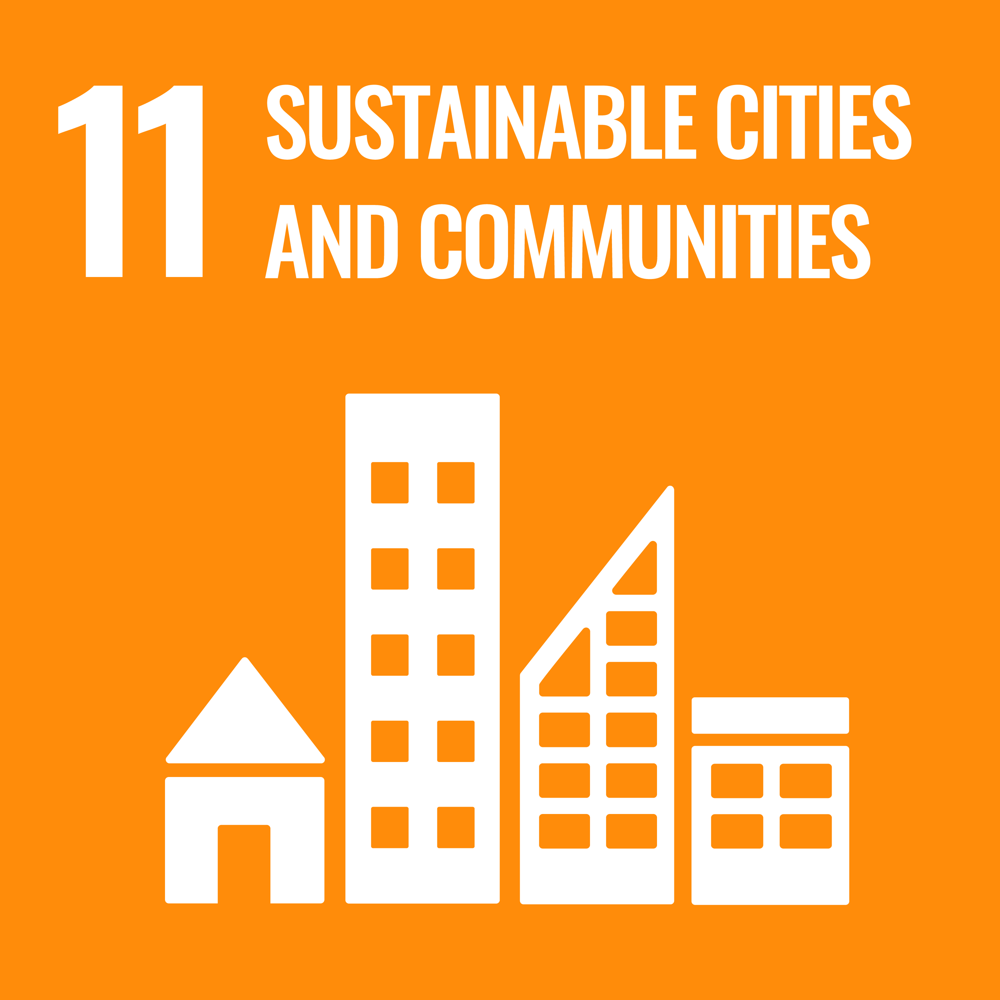
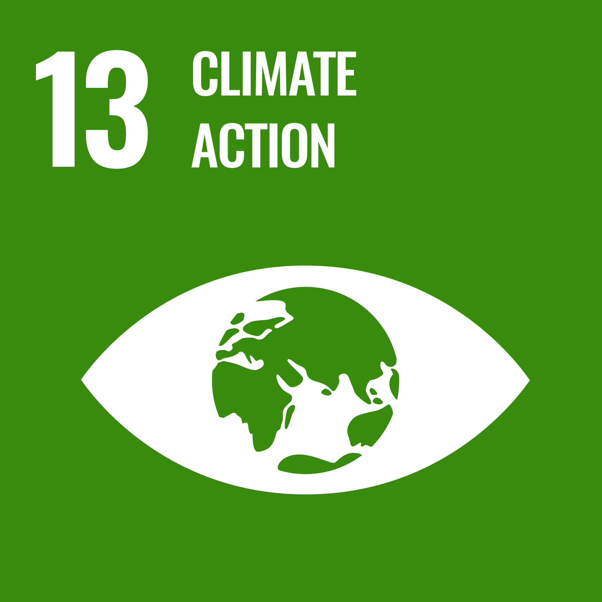

## Wrapping Up ...

This comes to the end of my learning diary, and what a three months it has been! The journey has truly been eye opening really, building up knowledge in remote sensing and exploring a wide range of concepts and techniques in remote sensing data analysis. It has been both enjoyable and very insightful, and I've genuinely enjoyed every part of it. Lastly, the module concludes with a group application project tackling a real-world problem of the energy challenge in Barcelona, Spain.

## Project

Our group project aims to build upon the existing dashboard: [**Map: How much energy can you generate?**](https://www.energia.barcelona/en/generate-energy/generar-energia/map-how-much-energy-can-you-generate) by integrating an Earth Observation approach to identify where photovoltaic solar installations should be prioritised, supporting more targeted decision-making and help Barcelona to accelerate progress towards its wider energy, climate, and equity goals.

::: {layout-ncol="3"}

:::

::: {style="margin: 1rem 0;"}
<iframe src="https://christychoicc.github.io/RSCE_GROUP" width="100%" height="600" style="border:1px solid #ddd; border-radius:8px;">

</iframe>
:::

View the full presentation: [here](https://christychoicc.github.io/RSCE_GROUP/)

View our GitHub Repository: [here](https://github.com/christychoicc/RSCE_GROUP)

## Final Words...

This is the end of the learning diary, thank you for reading and I hope you enjoy this as much as I do! Remote sensing has truly captured my curiosity, and so I will be exploring this more in my next journey, dissertation!
