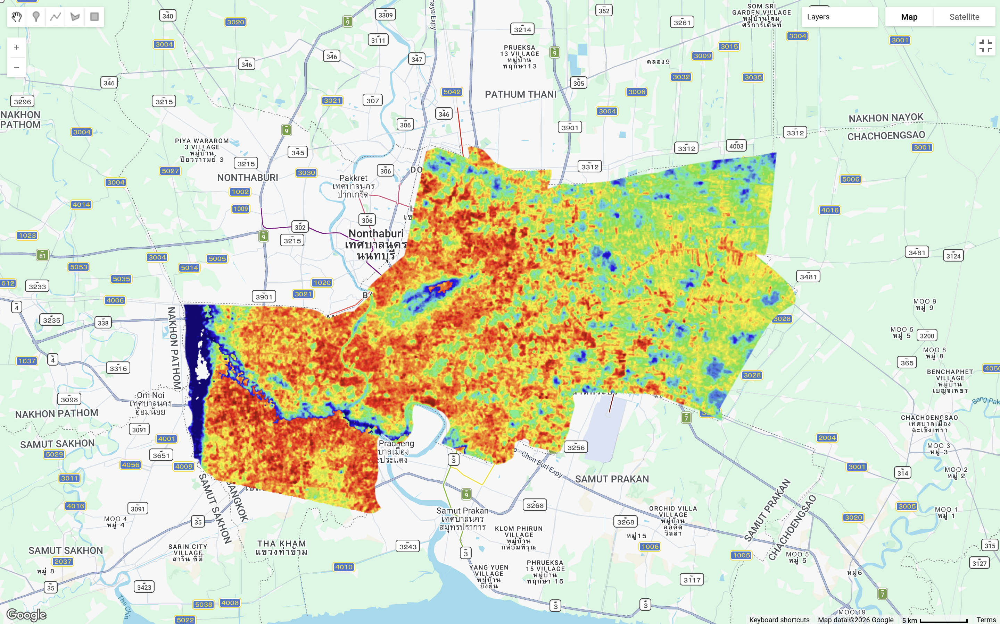
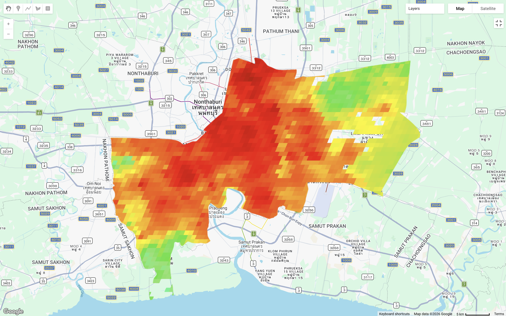
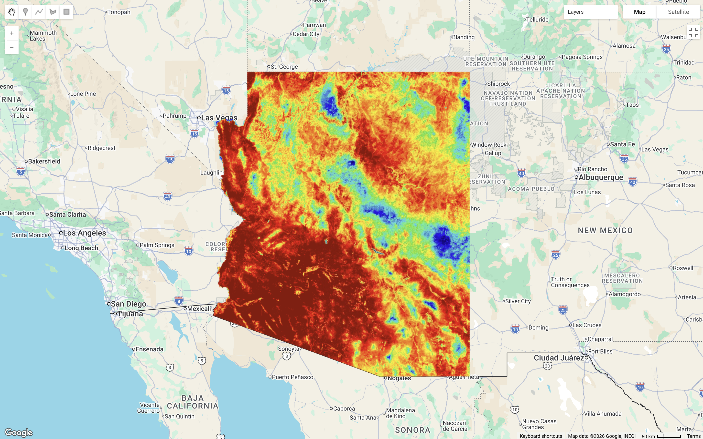
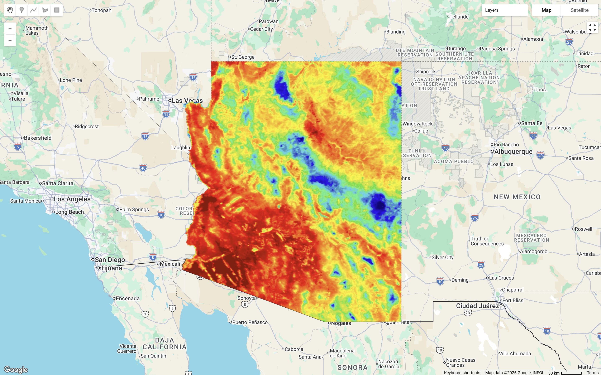
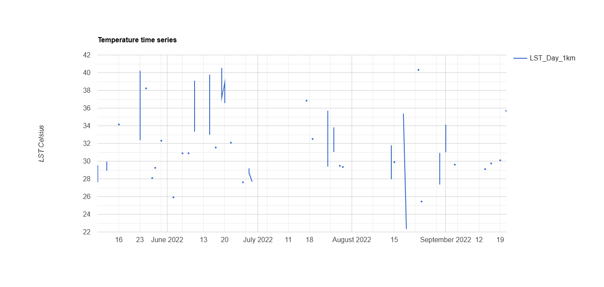
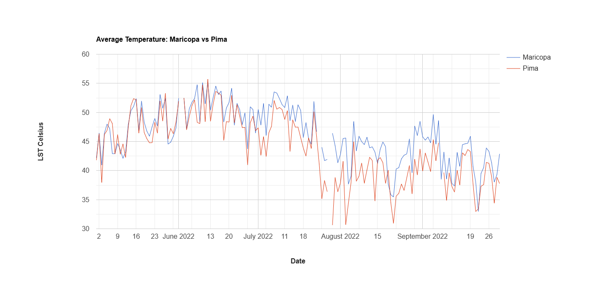
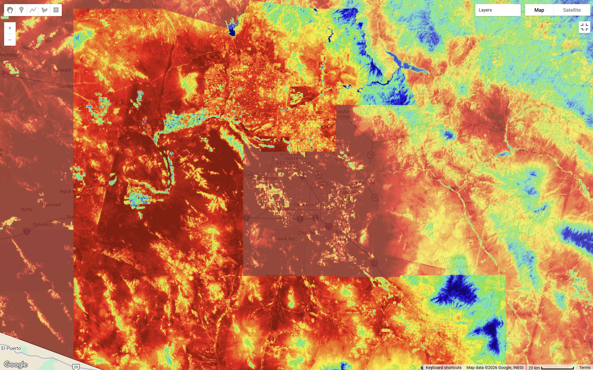
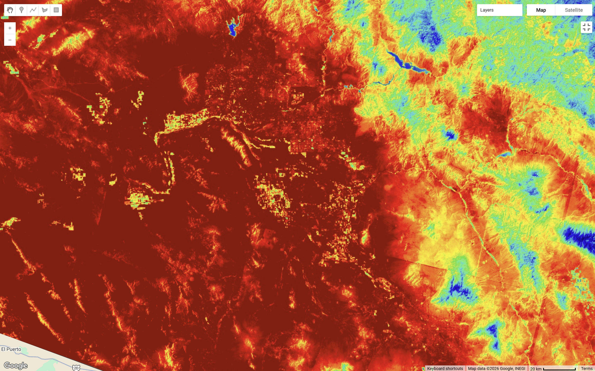
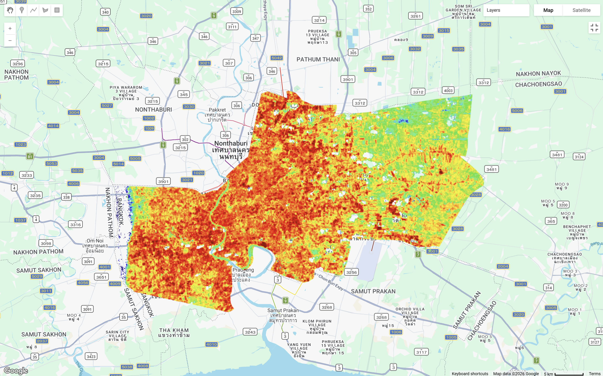

This section will go through assessing temperature research through GEE.

## Summary

Try to look at different LST mapping under different climates.

Bangkok Thailand is characterise by a hot humid rainy climate

::: {layout-ncol="2"}

:::

Astonia, USA is characterised by an extremely hot dessert climate.

::: {layout-ncol="2"}

:::

Looking at the chart it shows that the minimum temperature between the time series is a bit over 30 as a minimum and max temperature exceeding 50. Therefore, try changing minimum maximum temperature below,

::: {layout-ncol="2"}
{alt="Landsat LST"}

{alt="MODIS, Aqua and Terra"}
:::

GEE code for this practical can be found [here](https://code.earthengine.google.com/0c9f8558f28a429a32895861098c6ecb).

## Applications

## Reflections

During my exploration, I also found out that cloud covers can affect temperature.

::: {layout-ncol="2"}

{#reference}
:::
