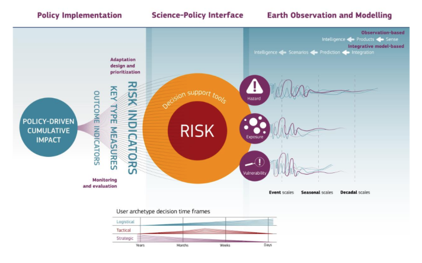

This section will be focused on using Google Earth Engine to explore land surface temperature (LST) and compare how thermal patterns vary across different climates, spatial scales and satellite products. Building upon the early chapters of discussing Urban Heat Island Effect (UHI) in [Policy](https://christychoicc.github.io/RSCE/policy.html), this section will also look at how land surface temperature can be used to mitigate UHI and policy relevance.

## Summary

### Land Surface Temperature

Land Surface Temperature (LST) is a parameter that reflects the interactions bewteen Earth surface and atmosphere from regional to global scales as well as an indicator that influences vegetation growth [@li2023a]. Rapid urbanisation and increasing population has caused more land surfaces to be covered with concrete, asphalt and other impervious materials that absorb and retain heat. This raises land surface temperatures in cities, more frequent and prolonged heatwaves, and raising important questions for planning, health and sustainability.

#### LST in GEE

The below compares the difference between Landsat and MODIS for temperature analysis with a temperature range between 20°C and 55°C. Landsat gave much more spatial detail, which made it easier to identify finer scale thermal variation and smaller hot and cooler patterns within urban areas. In contrast, MODIS is more coarse, useful for broader wider scale temporal monitoring. Taking it further, I have been quite curious to look at how thermal patterns vary across different climate and urban forms. So the following will inspect Bangkok, Thailand (city scale) and Arizona, USA (state scale) LST under Landsat 8 and MODIS.

Bangkok, with its hot, humid and rainy climate, showed a much more fragmented thermal pattern, with finer-scale variation across the urban area.

::: {layout-ncol="2"}

:::

Arizona, by contrast, showed more extensive and continuous high-temperature patterns, which seemed consistent with a much drier environment and fewer cooling influences.

::: {layout-ncol="2"}

:::

#### Time Series

Comparing the MODIS time series, Bangkok appeared more discontinuous, which I think is likely to be related to missing observations caused by cloud cover in its humid and rainy environment. Arizona, in contrast, showed denser and more continuous values, with a clearer seasonal trends and generally higher temperatures. This made me realise that temperature analysis is not only about climate differences, but also about the availability and quality of observations under different atmospheric conditions.

::: {layout-ncol="2"}
{alt="Landsat LST"}

{alt="MODIS, Aqua and Terra LST"}
:::

::: {style="border: 1px solid #ddd; border-left: 4px solid #e0a800; padding: 10px 15px; color: #e0a800; border-radius: 4px; margin-bottom: 15px;"}
MODIS is more useful for plotting time series due to its high observation frequency, yet the trade off here is when we plot time series we will simultaneously lose the spatial element...
:::

**Focusing on a smaller study area ...**

Zooming into Arizona, I initially wanted to compare all level 2 administrative units in one chart, but GEE returned the error message “Response size exceeds limit”, so I narrowed the analysis to Maricopa and Pima counties. I actually found this useful, because it made the comparison more manageable and also showed how GEE constraints can shape analysis choices. The chart suggested both counties remained consistently hot, with minimum temperatures around 30°C and maximum values above 55°C. Therefore, I adjusted the visualisation range to 30°C - 60°C to better reflect the actual distribution of values on map.

This also made me think of perhaps using reducer percentile function `reducer: ee.Reducer.percentile([10, 20, 30, 40, 50, 60, 70, 80, 90]`, thermal comfort index or a categorised calculation of "Discomfort Index" based on temperature data instead may be a more appropriate choice ([CASA0023](https://andrewmaclachlan.github.io/CASA0023/))[@patel2024; @sobrino2013a]. This will allow the visualisation range to be based on the distribution of values rather than manually choosing the thresholds by hand.

::: {layout-ncol="2"}
{alt="Landsat LST"}

{alt="MODIS, Aqua and Terra"}
:::

GEE code for this practical can be found [here](https://code.earthengine.google.com/0c9f8558f28a429a32895861098c6ecb).

+---------------------------------------------------------------------------------------+-----------------------------------------------------------------------------------------------------------------------------------------------------------------------------------------------------------------------------------------------------------------------------+
| LST Strengths                                                                         | LST Limitations                                                                                                                                                                                                                                                             |
+=======================================================================================+=============================================================================================================================================================================================================================================================================+
| -   Allows direct comparison of multi-temporal LST images without modifications       | -   Highly dependent on atmospheric correction (Cloud coverage can affect accuracy, see [Reflection](https://christychoicc.github.io/RSCE/temperature.html#reflections) section below) and is difficult to separate surface temperature, emissivity and atmospheric effects |
|                                                                                       |                                                                                                                                                                                                                                                                             |
| -   Allows large scale spatial monitoring, seasonal variations, etc.                  | -   Represents radiometric temperature (surface) not physical temperature                                                                                                                                                                                                   |
|                                                                                       |                                                                                                                                                                                                                                                                             |
| -   Able to identify spatial inequalities of thermal environments                     | -   Spatial discontinuity, where cannot penetrate through clouds there will be missing LST values                                                                                                                                                                           |
|                                                                                       |                                                                                                                                                                                                                                                                             |
| -   Findings can support decision-making and climate adaption / mitigation strategies | -   Mixed pixels makes it harder to interpret over heterogeneous surfaces                                                                                                                                                                                                   |
|                                                                                       |                                                                                                                                                                                                                                                                             |
|                                                                                       | -   Short time span limiting long time series analysis                                                                                                                                                                                                                      |
|                                                                                       |                                                                                                                                                                                                                                                                             |
|                                                                                       | -   Limited spatiotemporal comparability and difficult validation, as surface temperature changes quickly across time and observation conditions                                                                                                                            |
|                                                                                       |                                                                                                                                                                                                                                                                             |
|                                                                                       |     (Validation methods: T-based / R-based / Intercomparison Method / Bibliometric Analysis)                                                                                                                                                                                |
+---------------------------------------------------------------------------------------+-----------------------------------------------------------------------------------------------------------------------------------------------------------------------------------------------------------------------------------------------------------------------------+

: Sources: @li2013, @li2023a, @rasul2017

## Applications

Temperature has been widely used in literature to study urban heat island (UHI) and surface urban heat island (SUHI) to supporting planning decisions. Many studies incorporate land cover patterns to identify and understand any influences in temperature. Very relevant to planning, UHI and SUHI studies are often linked to questions of heat exposure, green infrastructure, and climate adaptation. In the context of greening strategies, studies found a quantitative relationship between land surface temperature (LST) and land use land cover change (LULCC), where mean LST increases as a result of vegetation loss and its replacement with impervious surfaces [@patel2024].

I personally think LST becomes more valuable when it is linked to heat exposure and vulnerability. Some studies show that hotter surface conditions are not experienced evenly across urban populations, which makes LST relevant to climate and environmental justice.

LST is not limited to academic research but also policy relevance. International organisations such as WMO and UN-Habitat framed urban heat monitoring as important for urban resilience, public services and climate adaptation. NASA and Copernicus also demonstrates how Earth observation can be used to support policy decisions on urban heat risk [@observer]. This makes LST a particularly useful measure for mitigation strategies through identifying where greening, shading, reflective materials, or improved urban layouts should be prioritised, rather than being used purely as a measure of thermal comfort.

### Methodological Limitations

Remote sensing approaches are widely recognised for improving understanding of the spatial and temporal variability of urban climate over the long term. Yet it does have limitations, particularly in data accuracy, as satellites capture surface conditions indirectly and cloud cover can distort the reliability of thermal imagery. Most researchers use temporally composite products, typically from MODIS, to reduce missing data impacted by cloud cover. Alternatively, some studies focus on nighttime thermal imagery as higher daytime solar radiation is likely to increase boundary-layer instability and cloud formation, making observations less consistent [@hu2013]. As seen below, night time has relatively fewer black pixels of missing or masked data:

### Products for LST

| Resolution | Products | Spatial Resolution | Temporal Resolution |
|----|----|----|----|
| Low | ASTER, Landsat Band 10 | 90 m, 30 m | 16 days revisit |
| Medium | MODIS, with Aqua and Terra | 1 km | Terra: N to S morning and Aqua: S to N afternoon, 1-2 days with 2 images a day |
| High | LSA-SAF (MSG/SEVIRI), GOES-R ABI, Copernicus Global Land Service / GlobTemperature | 3–5 km, 2–10 km, 0.05° |  |

: Sources: @li2023a

## Reflections

I am really stressing over clouds here. During my exploration in GEE, I realised how cloud coverage can really affect temperature outputs. Comparing the two cloud removing approaches has showed me how different pre-processing nethods can affect temperature outputs. Using cloud cover filter still left a suspicious cool edge on the left side of the city, whereas the `QA_PIXEL` mask removed that area entirely, suggesting it was likely to be clouds instead of a real temperature pattern. But one more limitation here, it removed some values giving some empty pixels. This make me realise that filtering cloud cover is not necessarily always "the best" choice, especially in this case for temperature analysis as cloud coverage can still remain in parts of the image. Given that, pixel level masking seems to be a better option for more reliable outputs, yet it also creates a trade off in reducing the amount of usable data.

::: {layout-ncol="2"}
{alt="Landsat LST"}

{alt="MODIS, Aqua and Terra"}
:::

Apart from atmospheric effects, LST also depends on a many other decisions, including scale, data processing methods and interpretation. Even with these limitations, it is still a useful tool for climate adaptation, environmental justice, urban planning and potentially public health, when combined with demographic or land cover data. I feel like there is still a lot more to explore with LST, such as LST with NDVI, NDWI, NDBI and NMDI, etc. and is definitely something I would be interested in exploring further in the near future.
