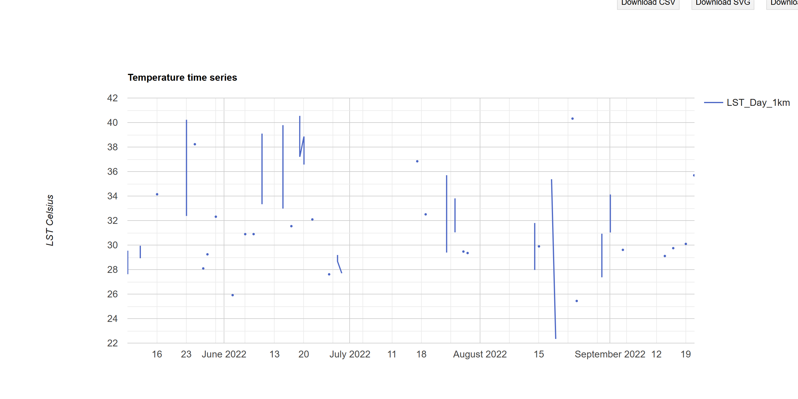

This section will go through how to conduct temperature research through GEE. Building upon the early chapters of discussing Urban Heat Island Effect in [Policy](https://christychoicc.github.io/RSCE/policy.html), this section will focus on land surface temperature......

## Summary

### Land Surface Temperature

Land Surface Temperature (LST) is a parameter that reflects land-atmosphere interactions from regional to global scales as well as an indicator that influences vegetation growth [@li2023a]. Urbanisation, increasing population has caused more land surfaces to be covered with concrete, asphalt and other impervious materials that absorb and retain heat, which contributes to higher land surface temperatures within our urban environments.

#### LST in GEE

The below compares the difference between Landsat and MODIS for temperature analysis with a temperature range between 20°C and 55°C. Landsat gave much more spatial detail, which made it easier to identify finer scale thermal variation and smaller hot and cooler patterns within urban areas. In contrast, MODIS is more coarse, useful for broader wider scale temporal monitoring with its more frequent observations. Taking it further, I have been quite curious to look at how thermal patterns varies across different climate and urban forms. So the following will inspect Bangkok, Thailand (city scale) and Arizona, USA (state scale) under Landsat 8 and MOD

Bangkok is characterised with a hot, humid and rainy summer climate, which appears to have a more mixed and fragmented temperature pattern, with greater small-scale variation across the urban area.

::: {layout-ncol="2"}

:::

Arizona in contrast has an extremely hot desert climate. It shows much more extensive high temperature patterns, suggesting a greater extent of hot, consistent with dry surfaces and less cooling influence from the Sonoran Desert.

::: {layout-ncol="2"}

:::

#### Time Series

Comparing the two time series chart, Bangkok appears more discontinuous which is likely to reflect missing data from observations containing clouds, which makes sense in a humid and rainy environment. Arizona in contrast has more dense and continuous values with higher temperature and reflecting more of a seasonal trend. This comparison showed temperature analysis also depends on availability and quality of observations under different atmospheric conditions.

::: {layout-ncol="2"}
{alt="Landsat LST"}

{alt="MODIS, Aqua and Terra LST"}
:::

::: {style="border: 1px solid #ddd; border-left: 4px solid #d9534f; padding: 10px 15px; color: #d9534f; border-radius: 4px; margin-bottom: 15px;"}
Note that for MODIS the trade off here is that we get to plot time series but we simultaneously will lose the spatial element...
:::

Zooming into Arizona, I initially wanted to compare all level 2 administrative units, however, GEE returned the error message “Response size exceeds limit” so I narrowed the analysis to two districts so it is more manageable for GEE. Looking at Maricopa and Pima, both counties show very high summer LST values, with peaks above 50°C, where Maricopa appears slightly hotter overall. This demonstrated the ability to zoom into smaller spatial units, allowing finer thermal variation on county levels to be observed and compared for patterns that may be not seen under a broader regional scale.

Looking at the chart it shows that the minimum temperature between the time series is a bit over 30 as a minimum and max temperature exceeding 50. Therefore, try changing minimum maximum temperature below,

::: {layout-ncol="2"}
{alt="Landsat LST"}

{alt="MODIS, Aqua and Terra"}
:::

GEE code for this practical can be found [here](https://code.earthengine.google.com/0c9f8558f28a429a32895861098c6ecb).

+---------------------------------------------------------------------------------------+-----------------------------------------------------------------------------------------------------------------------------------------------------------------------------------------------------------------------------------------------------------------------------+
| Strengths                                                                             | Limitations                                                                                                                                                                                                                                                                 |
+=======================================================================================+=============================================================================================================================================================================================================================================================================+
| -   Allows direct comparison of multi-temporal LST images without modifications       | -   Highly dependent on atmospheric correction (Cloud coverage can affect accuracy, see [Reflection](https://christychoicc.github.io/RSCE/temperature.html#reflections) section below) and is difficult to separate surface temperature, emissivity and atmospheric effects |
|                                                                                       |                                                                                                                                                                                                                                                                             |
| -   Allows large scale spatial monitoring, seasonal variations, etc.                  | -   Represents radiometric temperature (surface) not physical temperature                                                                                                                                                                                                   |
|                                                                                       |                                                                                                                                                                                                                                                                             |
| -   Able to identify spatial inequalities of thermal environments                     | -   Spatial discontinuity, where cannot penetrate through clouds there will be missing LST values                                                                                                                                                                           |
|                                                                                       |                                                                                                                                                                                                                                                                             |
| -   Findings can support decision-making and climate adaption / mitigation strategies | -   Mixed pixels makes it harder to interpret over heterogeneous surfaces                                                                                                                                                                                                   |
|                                                                                       |                                                                                                                                                                                                                                                                             |
|                                                                                       | -   Short time span limiting long time series analysis                                                                                                                                                                                                                      |
|                                                                                       |                                                                                                                                                                                                                                                                             |
|                                                                                       | -   Limited spatiotemporal comparability and difficult validation, as surface temperature changes quickly across time and observation conditions                                                                                                                            |
|                                                                                       |                                                                                                                                                                                                                                                                             |
|                                                                                       |     (Validation methods: T-based / R-based / Intercomparison Method / Bibliometric Analysis)                                                                                                                                                                                |
+---------------------------------------------------------------------------------------+-----------------------------------------------------------------------------------------------------------------------------------------------------------------------------------------------------------------------------------------------------------------------------+

: Sources: @li2013, @li2023a, @rasul2017

### Urban Heat Island Effect 

Temperature analysis has been widely used in literature to study urban heat island (UHI) and surface urban heat island (SUHI) to supporting planning decisions.

#### Impacts

+-------------+-----------------------------------------------------------------------------------------+
|             | Impacts                                                                                 |
+=============+=========================================================================================+
| Social      | -   Health implications such as respiratory illnesses, etc.                             |
|             |                                                                                         |
|             | -   Negatively impact the vulnerable population (people of old age, autoimmunity, etc.) |
|             |                                                                                         |
|             | -   Increase mortality rates                                                            |
+-------------+-----------------------------------------------------------------------------------------+
| Economic    |                                                                                         |
+-------------+-----------------------------------------------------------------------------------------+
| Environment |                                                                                         |
+-------------+-----------------------------------------------------------------------------------------+

#### Policy

## Applications

Remote sensing approaches are widely recognised for improving understanding of the spatial and temporal variability of urban climate over the long term. Yet it does have limitations, particularly in data accuracy, as satellites capture surface conditions indirectly and cloud cover can distort the reliability of thermal imagery. Some studies focus on nighttime thermal imagery as higher daytime solar radiation is likely to increase boundary-layer instability and cloud formation, making observations less consistent [@hu2013]. Others use temporally composited products, typically from MODIS, to reduce missing data impacted by cloud cover.

Furthermore, studies have incorporate land cover patterns to identify any influences in temperature.

### LST Products

| Resolution | Products | Spatial Resolution | Temporal Resolution |
|----|----|----|----|
| Low | ASTER, Landsat Band 10 | 90 m, 30 m | 16 days revisit |
| Medium | MODIS, with Aqua and Terra | 1 km | Terra: N to S morning and Aqua: S to N afternoon, 1-2 days with 2 images a day |
| High | LSA-SAF (MSG/SEVIRI), GOES-R ABI, Copernicus Global Land Service / GlobTemperature | 3–5 km, 2–10 km, 0.05° |  |

: Sources: @li2023a

## Reflections

During my exploration in GEE, I realised how cloud coverage can affect temperature outputs. Comparing the two cloud removing approaches has showed me how different pre-processing nethods can affect temperature outputs. Using cloud cover filter still left a suspicious cool edge on the left side of the city, whereas the QA_PIXEL mask removed that area entirely, suggesting it was likely to be clouds instead of a real temperature pattern. This make me realise that filtering cloud cover is not always "the best" choice, especially in this case for temperature analysis as cloud coverage can still remain in parts of the image. Given that, pixel level masking seems to be a better option for more reliable outputs, yet it also creates a trade off in reducing the amount of usable data...

::: {layout-ncol="2"}
{alt="Landsat LST"}

{alt="MODIS, Aqua and Terra"}
:::

Apart from atmospheric effects, LST also depends on a many other decisions, including scale, data processing methods and interpretation. Even with these limitations, it is still a useful tool for studying climate adaptation, environmental justice, urban planning and potentially public health, especially when combined with demographic or land-cover data. I feel like there is still a lot more to explore with LST, such as LST with NDVI, NDWI, NDBI and NMDI, etc. and it is something I would be interested in exploring further in the future.
